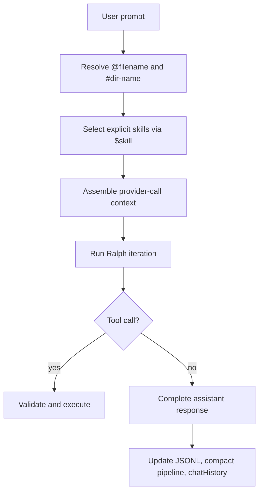
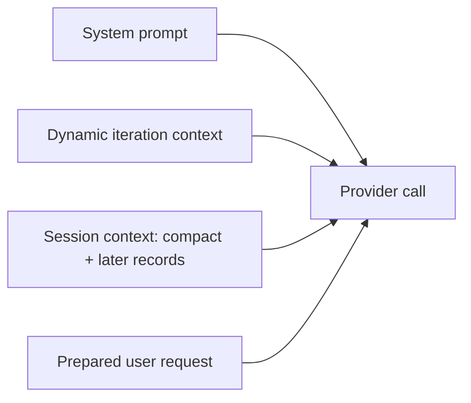

# orch

<div align="center">
  <h1>orch</h1>
  <p><strong>A local agent runner that treats repository work like a sessioned operating environment.</strong></p>
  <p>
    ReAct and Plan modes · Bubble Tea TUI · Workspace references · Skill selection · Pointer-aware compaction
  </p>
</div>

<table>
  <tr>
    <td><strong>Runtime</strong></td>
    <td>Go + Bubble Tea + Ollama / vLLM</td>
    <td><strong>Primary Interface</strong></td>
    <td>TUI with `orch exec` parity</td>
  </tr>
  <tr>
    <td><strong>Workspace Model</strong></td>
    <td>Provisioned `test-workspace`</td>
    <td><strong>Session Artifacts</strong></td>
    <td>JSONL + compact + <code>chatHistory.md</code></td>
  </tr>
  <tr>
    <td><strong>Reference Syntax</strong></td>
    <td><code>@filename</code>, <code>#dir-name</code>, <code>$&lt;skill-name&gt;</code></td>
    <td><strong>Built-in CLI Surface</strong></td>
    <td><code>ot read</code>, <code>ot list</code>, <code>ot search</code>, <code>ot pointer</code>, <code>ot subagent</code></td>
  </tr>
</table>

<blockquote>
  <p><strong>What makes this unusual?</strong></p>
  <p>
    <code>orch</code> does not treat a coding run as a stateless prompt-response exchange. It keeps a raw transcript,
    a rolling conversation digest, a compacted reinjection summary, explicit tool contracts, and workspace-scoped
    references, then rebuilds model context on every provider call.
  </p>
</blockquote>

## Why It Exists

Most local coding agents are strong at one of two things:

- direct tool execution
- session continuity

`orch` is built around both.

It runs a local agent loop against a repository, but it also keeps the conversation legible and recoverable through:

- append-only session JSONL
- pointer-aware compact summaries
- rolling `chatHistory.md` digestion for weaker sLLMs
- explicit per-call tool and skill reinjection
- fast workspace references for files and directories

## Mental Model



## Capability Matrix

| Axis | What It Covers | Anchor |
| --- | --- | --- |
| Interaction Modes | ReAct execution and plan-only authoring | `react_ralph_iter`, `plan_ralph_iter` |
| Session Memory | JSONL, compact, `chatHistory.md`, current-session pointers | `.orch/` |
| Prompt Context | tools, skills, references, digest reinjection | per-provider-call assembly |
| Built-in CLI Surface | `ot read`, `ot list`, `ot search`, `ot pointer`, `ot subagent` | `exec` |
| TUI Workflow | slash menu, history picker, session reset, compaction | Bubble Tea |
| Workspace Runtime | provisioned `test-workspace` and bootstrap assets | `internal/workspace` |

## Install

Primary install path:

```bash
curl -fsSL https://raw.githubusercontent.com/keonho-kim/orch/main/install.sh | sh
```

Optional install controls:

```bash
curl -fsSL https://raw.githubusercontent.com/keonho-kim/orch/main/install.sh | VERSION=v0.1.0 BINDIR="$HOME/.local/bin" sh
```

Manual release install:

```bash
curl -fsSLO https://github.com/keonho-kim/orch/releases/download/v0.1.0/orch_0.1.0_darwin_arm64.tar.gz
tar -xzf orch_0.1.0_darwin_arm64.tar.gz
install -m 0755 orch "$HOME/.local/bin/orch"
install -m 0755 ot "$HOME/.local/bin/ot"
```

Go toolchain install:

```bash
go install github.com/keonho-kim/orch/cmd/orch@latest
go install github.com/keonho-kim/orch/cmd/ot@latest
```

## Quick Start

```bash
go run ./cmd/orch
```

Common entrypoints:

```bash
orch
orch --workspace .
orch exec "inspect the failing tests"
orch exec --workspace . --mode plan "design a safer config migration"
orch history
orch history --workspace . --latest
```

## Runtime Axes

The project is easiest to understand through its major runtime axes:

| Axis | Description | Deep Document |
| --- | --- | --- |
| CLI and Entrypoints | command parsing, exec mode, history mode, startup path selection | [docs/architecture.md](docs/architecture.md) |
| Orchestrator | Ralph loop, approvals, prompt assembly, references, skill selection | [docs/architecture.md](docs/architecture.md) |
| Session Model | JSONL, compact, `chatHistory.md`, `ot-pointer`, session switching | [docs/session-model.md](docs/session-model.md) |
| Tooling | `exec` vs `ot`, approval rules, subcommands, path policy | [docs/tooling.md](docs/tooling.md) |
| Prompting Context | system prompt, dynamic context, references, tools, skills | [docs/prompting-context.md](docs/prompting-context.md) |
| TUI | slash dropdown, composer modes, history picker, reasoning visibility | [docs/tui.md](docs/tui.md) |
| Workspace Bootstrap | `test-workspace`, bootstrap assets, preserved user state | [docs/workspace-bootstrap.md](docs/workspace-bootstrap.md) |

## Command Overview

### Interactive Entry

```bash
orch
orch --workspace .
```

### One-Shot Execution

```bash
orch exec "inspect the failing tests"
orch exec --workspace . --mode plan "design a safer config migration"
```

### Session History

```bash
orch history
orch history --workspace . --latest
orch history 20260313-120000.000 --workspace .
```

## Built-in Tooling Model

The model sees one callable tool: `exec`.

That is the model-facing tool contract.

Inside `exec`, `orch` exposes one built-in CLI surface: `ot`.

### Model Tool

| Tool | Role |
| --- | --- |
| `exec` | The only structured tool exposed to the model |

### Built-in CLI Surface: `ot`

Within `exec`, `orch` exposes a curated local command model through `ot` subcommands:

| Command | Purpose | Availability |
| --- | --- | --- |
| `ot read --path <path>` | Read file content or inspect a directory | ReAct + Plan |
| `ot list [--path <path>]` | Long listing for a directory or file | ReAct + Plan |
| `ot search [--path <path>] [--name <glob>] [--content <pattern>]` | Curated search | ReAct + Plan |
| `ot pointer --value <ot-pointer>` | Read current-session JSONL lines referenced in compact or `chatHistory.md` | ReAct |
| `ot subagent --prompt "<task>"` | Run a bounded child ReAct session | ReAct |

Approval model:

| Case | Approval |
| --- | --- |
| Workspace `ot read` / `ot list` / `ot search` | auto-allowed |
| External read-only OT access | approval required |
| `ot write` | approval required |
| `ot subagent` | approval required unless self-driving mode is enabled |
| `rm`, `mv` | always approval-gated |

## Session Artifacts

| Artifact | Role | Source of Truth |
| --- | --- | --- |
| `.orch/sessions/<session-id>.jsonl` | raw transcript records | yes |
| compact record in session JSONL | reinjection compression for older turns | derived |
| `.orch/chatHistory.md` | rolling whole-conversation digest for sLLMs | derived |
| `ot-pointer://current?...` | reference to current-session JSONL lines | derived |

### JSONL vs Compact vs chatHistory

| Aspect | JSONL | Compact | `chatHistory.md` |
| --- | --- | --- | --- |
| Raw user/assistant content | yes | no | no |
| Used for restore | yes | yes | no |
| Used for live reinjection | compact + later raw records | yes | yes |
| Pointer-bearing | indirectly | yes | yes |
| Scope | one session | one session | rolling session digest |

## Prompt Assembly

On every provider call, `orch` assembles context from multiple layers:



See [docs/prompting-context.md](docs/prompting-context.md) for the full provider-call assembly contract.

## Repository Layout

```text
cmd/                         CLI entrypoints
internal/orchestrator/       run lifecycle, references, skill selection, prompt assembly
internal/session/            JSONL, compact, chatHistory, pointers
internal/tooling/            exec and ot policy / execution
internal/tui/                Bubble Tea model and rendering
runtime-asset/bootstrap/     provisioned AGENTS / USER / SKILLS runtime inputs
tools/ot/                    curated shell-backed OT commands
docs/                        split project documentation
```

## Documentation Map

| Document | Purpose |
| --- | --- |
| [docs/architecture.md](docs/architecture.md) | package boundaries, runtime ownership, flow overview |
| [docs/session-model.md](docs/session-model.md) | JSONL, compact, chatHistory, pointers, `/clear`, `/compact` |
| [docs/tooling.md](docs/tooling.md) | `exec`, `ot`, approval rules, `ot pointer`, `ot subagent` |
| [docs/prompting-context.md](docs/prompting-context.md) | provider-call context assembly, references, tools, skills |
| [docs/tui.md](docs/tui.md) | interactive TUI behavior and command input semantics |
| [docs/workspace-bootstrap.md](docs/workspace-bootstrap.md) | provisioned workspace, bootstrap assets, preserved state |

## Development Notes

- Primary language: Go
- Module system: Go modules
- Local settings file: [orch.settings.json](orch.settings.json)
- Providers: `ollama`, `vllm`

Validation commands:

```bash
gofmt -w .
go test ./...
go vet ./...
golangci-lint run ./...
```

## Current Constraints

<details>
  <summary><strong>Operational constraints</strong></summary>

- `test-workspace` is provisioned runtime state, not authoring state
- `ot pointer` is intentionally current-session-only
- `/clear` does not open a new session while a run is active
- external read-only OT access still requires approval, even in self-driving mode

</details>
