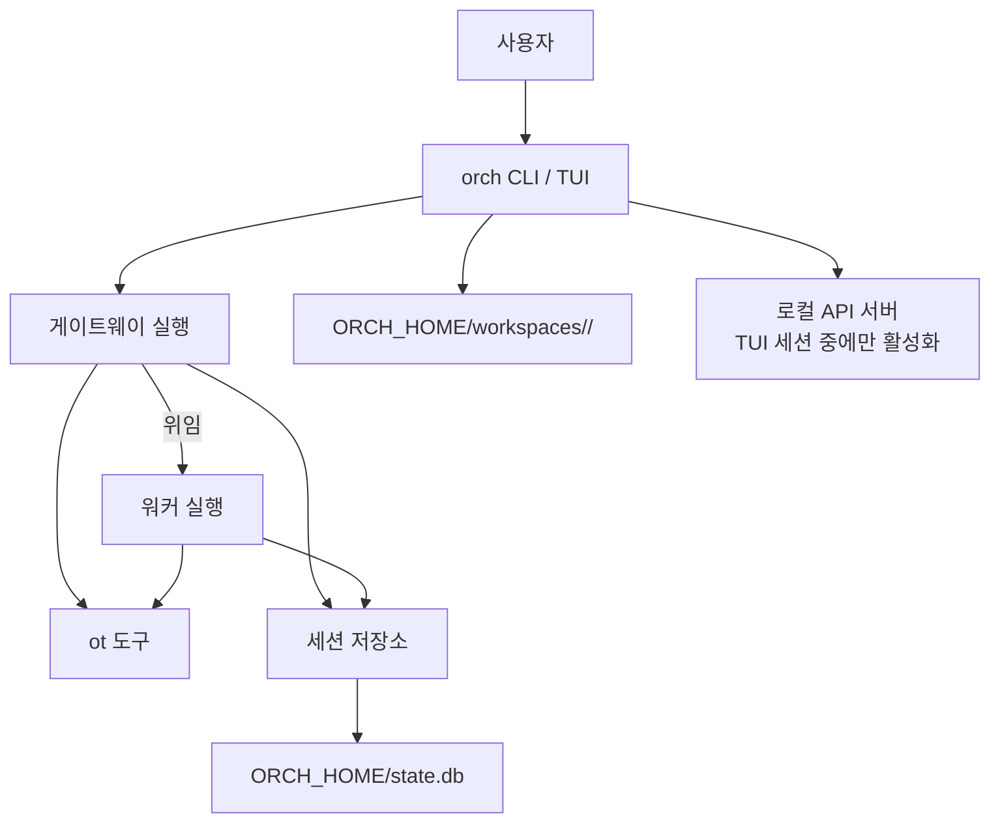

<div align="center">
  <h1>orch</h1>
  <p>로컬 저장소 작업을 위해 설계된 CLI·TUI 기반 에이전트 오케스트레이터</p>
  <p>
    
    
    
  </p>
  <p>
    <a href="#설치"><strong>설치</strong></a>
    ·
    <a href="#빠른-시작"><strong>빠른 시작</strong></a>
    ·
    <a href="./docs/system-overview.md"><strong>시스템 개요</strong></a>
    ·
    <a href="./docs/tui.md"><strong>TUI 안내</strong></a>
  </p>
</div>

<<<<<<< HEAD
`orch`는 로컬 저장소를 대상으로 동작하는 에이전트 런타임입니다. 현재 구조는 작은 모델에서도 일관된 실행 흐름을 유지하도록, 게이트웨이 조정자와 워커 실행자를 분리한 2계층 구조를 기본으로 사용합니다.

## 핵심 구조

- 게이트웨이: 요청 해석, 작업 분해, 위임, 결과 종합
- 워커: 위임된 작업 계약만 수행
- 모델 도구 표면: `ot` 하나로 고정
- 세션 지속성: `.orch/sessions/*.jsonl` 및 메타데이터
- 런타임 워크스페이스: `test-workspace/`
- 대화형 실행: TUI + 로컬 전용 HTTP/SSE API

## 설정

설정의 단일 소스 오브 트루스는 저장소 루트의 `orch.toml`입니다.

- 기본 경로: `<repo>/orch.toml`
- 공통 오버라이드: `--env-file <path>.toml`
- 사용 범위: `orch`, `orch exec`, `orch config`, TUI, 로컬 API 서버

예시:

```bash
orch config --list
orch config --provider=ollama --model=qwen3.5:35b --endpoint=http://localhost:11434/v1 --reasoning=high
orch config --provider=chatgpt --model=gpt-5.3-codex --api-key="<secret>" --reasoning=xhigh
orch config --env-file=.orch/dev.toml --provider=vllm --model=qwen3.5-coder --endpoint=http://localhost:8000/v1 --reasoning=false
```

`orch config --list`는 정규화된 TOML을 출력하며, `api_key`는 `앞 10글자 + *** + 뒤 5글자` 형식으로 마스킹됩니다.

지원 provider:

- `ollama`
- `vllm`
- `gemini`
- `vertex`
- `bedrock`
- `claude`
- `azure`
- `chatgpt`

reasoning 입력은 `true|false|low|medium|high|xhigh`를 사용합니다. 실제 전송 파라미터는 provider별 capability 규칙에 따라 매핑되며, 지원하지 않는 값은 명시적으로 오류를 반환합니다.

## 런타임 동작

- 게이트웨이와 워커는 서로 다른 OT operation 집합을 사용합니다.
- 실행 루프는 iteration 기반이며, 각 iteration에서 system prompt, context snapshot, tool catalog를 조립합니다.
- OT 실행은 operation registry를 통해 validation, approval, execution을 같은 규칙으로 처리합니다.
- provider transport는 provider spec과 stream decoder helper를 통해 공통 경로를 최대한 공유합니다.

게이트웨이 OT operation:

- `context`
- `task_list`
- `task_get`
- `delegate`
- `read`
- `list`
- `search`

워커 OT operation:

- `context`
- `task_list`
- `task_get`
- `read`
- `list`
- `search`
- `write`
- `patch`
- `check`
- `complete`
- `fail`

Plan mode는 읽기 전용이며 아래 operation만 허용합니다.

- `context`
- `task_list`
- `task_get`
- `read`
- `list`
- `search`

## 로컬 API

대화형 TUI 실행 시 같은 프로세스 안에서 로컬 API 서버가 시작됩니다.

- bind: `127.0.0.1:<ephemeral-port>`
- auth: `Authorization: Bearer <token>`
- discovery 파일:
  - `.orch/api/<session-id>.json`
  - `.orch/api/current.json`

주요 엔드포인트:

- `GET /v1/status`
- `GET /v1/events`
- `POST /v1/exec`
- `GET /v1/exec/{run_id}`
- `GET /v1/exec/{run_id}/events`
- `POST /v1/exec/{run_id}/approval`
- `GET /v1/history`
- `GET /v1/history/latest`
- `POST /v1/history/restore`
- `GET /v1/config`
- `PATCH /v1/config`

## 구현 기준

- provider 기본값과 필수 필드는 provider registry에서 관리합니다.
- 설정 문서와 TUI는 `endpoint`, `model`, `api_key`, `reasoning` 명칭을 공통으로 사용합니다.
- 거대 분기는 가능한 범위에서 registry, dispatcher, reducer 스타일 helper로 분해합니다.
- 설정 파일은 `orch.toml`만 사용합니다.

## 검증
=======
## 소개

`orch`는 저장소 안에서 일어나는 작업을 통제 가능한 흐름으로 실행하기 위한 로컬 에이전트 도구입니다.  
대화형 TUI, 단발성 CLI 실행, 이력 복원, 구조화된 도구 표면, 세션·기억 저장소를 함께 제공합니다.

기본 진입점은 `orch <요청>`입니다.  
필요하면 `orch exec`, `orch history`, `orch config`, `ot`를 별도로 사용할 수 있습니다.

지원하는 제공자는 다음과 같습니다.

- `ollama`
- `vllm`
- `gemini`
- `vertex`
- `bedrock`
- `claude`
- `azure`
- `chatgpt`

## 왜 orch인가

- **통제 가능한 실행 흐름**: 해석과 실행을 분리해 작업 범위를 명확하게 유지합니다.
- **작은 문맥, 분명한 계약**: 모델에는 `ot` 하나만 노출하고, 필요한 정보만 실행 문맥에 포함합니다.
- **지속되는 작업 이력**: 세션, 작업 결과, 기억, 스킬 정보를 로컬 저장소에 남겨 다음 실행에 활용합니다.

## 핵심 특징

- `orch <요청>`으로 바로 실행할 수 있는 기본 CLI 진입점
- 대화형 TUI와 세션 이력 복원 기능
- 역할별 권한이 나뉜 `ot` 도구 표면
- `ORCH_HOME` 기반 전역 상태 디렉터리와 프로젝트별 설정 오버라이드
- 세션, 작업 결과, 기억, 스킬을 함께 다루는 SQLite 저장소
- 대화형 세션 중 인증 토큰이 걸린 로컬 API 서버 제공

## 설치

### 릴리스 설치 스크립트 사용

저장소의 `install.sh`는 최신 릴리스에서 `orch`와 `ot`를 내려받아 설치합니다.

```bash
git clone https://github.com/keonho-kim/orch.git
cd orch
./install.sh
```

기본 설치 경로는 다음 규칙을 따릅니다.

- 쓰기 가능한 `/usr/local/bin`이 있으면 그 위치를 사용합니다.
- 그렇지 않으면 `$HOME/.local/bin`을 사용합니다.
- 다른 경로를 원하면 `BINDIR`을 지정합니다.

```bash
BINDIR="$HOME/.local/bin" ./install.sh
```

### 소스에서 직접 빌드

```bash
go build -o ./bin/orch ./cmd/orch
go build -o ./bin/ot ./cmd/ot
export PATH="$PWD/bin:$PATH"
```

## 빠른 시작

### 1. 전역 설정 파일 준비

기본 전역 루트는 `~/.orch`입니다. 다른 경로를 쓰려면 `ORCH_HOME`을 지정합니다.

```bash
mkdir -p ~/.orch
cat > ~/.orch/orch.env.toml <<'EOF'
version = 1

[orch]
default_provider = "ollama"

[provider.ollama]
base_url = "http://localhost:11434/v1"
model = "qwen3.5:32b"
EOF
```

### 2. 설정 확인

```bash
orch config --list --scope effective
```

### 3. 실행

```bash
orch "현재 저장소 구조를 요약해줘"
orch exec --mode plan "릴리스 절차를 계획해줘"
orch history
```

## 설정

설정은 전역 파일과 프로젝트 파일을 겹쳐서 읽습니다.

| 범위 | 위치 | 역할 |
| --- | --- | --- |
| 전역 | `~/.orch/orch.env.toml` | 기본 제공자, 공통 모델, 공용 환경 변수 |
| 프로젝트 | `./orch.env.toml` | 저장소별 모델 오버라이드, 저장소 전용 설정 |
| 적용 결과 | `orch config --list --scope effective` | 현재 실행에 실제로 적용되는 값 |

프로젝트 파일이 전역 파일을 덮습니다.

예를 들어 전역 설정은 그대로 두고 현재 저장소에서만 모델을 바꾸려면 다음처럼 둘 수 있습니다.

```toml
version = 1

[provider.ollama]
model = "qwen3.5:14b"
```

CLI로도 확인할 수 있습니다.

```bash
orch config --list --scope global
orch config --list --scope project
orch config --list --scope effective
```

## 주요 명령

| 명령 | 설명 |
| --- | --- |
| `orch` | 대화형 TUI를 엽니다. |
| `orch <request>` | 기본 실행 진입점입니다. |
| `orch exec --mode react "<request>"` | 단발성 실행을 수행합니다. |
| `orch exec --mode plan "<request>"` | 읽기 전용 계획 실행을 수행합니다. |
| `orch history` | 세션 이력을 엽니다. |
| `orch history --latest` | 가장 최근 세션을 바로 복원합니다. |
| `orch config --list --scope effective` | 현재 적용된 설정을 확인합니다. |
| `ot` | 파일 읽기, 검색, 패치 등에 쓰는 독립 실행 도구입니다. |

## 구조 한눈에



## 문서 안내

- [시스템 개요](./docs/system-overview.md)
- [아키텍처](./docs/architecture.md)
- [세션 모델](./docs/session-model.md)
- [도구 계약](./docs/tooling.md)
- [TUI 안내](./docs/tui.md)
- [실행 워크스페이스와 상태 디렉터리](./docs/workspace-bootstrap.md)
- [Helper Binary 관리](./docs/helper-binaries.md)
- [실행 문맥](./docs/prompting-context.md)

## 개발과 검증
>>>>>>> cef7a8c (update)

```bash
gofmt -w .
go test ./...
go vet ./...
golangci-lint run ./...
```
