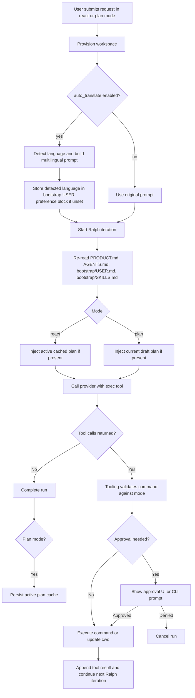

# Architecture

## Supported Behavior

- `orch` is a single-session local agent runner.
- Inference is provided only by Ollama and vLLM over HTTP.
- The binary supports both an interactive TUI and a one-shot CLI execution path.
- The runtime workspace is provisioned at `./test-workspace`.
- The run loop has two modes:
  - `react`
  - `plan`
- The model sees one `exec` tool and the tooling layer enforces the mode-specific command contract.
- An optional `auto_translate` preprocessing step can detect one language bucket (`kor`, `en`, or `ch`), translate into the other two in parallel, and build a multilingual Korean/English/Chinese request bundle before the main agent loop starts.

## Boundaries

- Entrypoint: [cmd/main.go](/Users/khkim/dev/orch/cmd/main.go) starts the selected interface.
- Main CLI: [cmd/cli.go](/Users/khkim/dev/orch/cmd/cli.go) parses `orch`, `orch tui`, and `orch exec [--mode react|plan]`.
- Tool CLI: [cmd/ot/main.go](/Users/khkim/dev/orch/cmd/ot/main.go) dispatches curated `ot` subcommands.
- Domain: [domain/types.go](/Users/khkim/dev/orch/domain/types.go) owns provider, run mode, settings, run records, and plan-cache models.
- Config: [internal/config/config.go](/Users/khkim/dev/orch/internal/config/config.go) resolves repo and user-state paths plus settings file I/O.
- Store: [internal/store/sqlite/store.go](/Users/khkim/dev/orch/internal/store/sqlite/store.go) owns history, runs, run events, and persisted plan cache state.
- Workspace: [internal/workspace/workspace.go](/Users/khkim/dev/orch/internal/workspace/workspace.go) provisions `test-workspace`, preserves `bootstrap/USER.md`, syncs `tools/**`, and does not create a `.claude` mirror.
- Auto-translate: [internal/autotranslate/service.go](/Users/khkim/dev/orch/internal/autotranslate/service.go) owns language detection and isolated translation requests without bootstrap context or tools.
- User preferences: [internal/userprefs/userprefs.go](/Users/khkim/dev/orch/internal/userprefs/userprefs.go) manages the hidden TOML preference block inside `bootstrap/USER.md`.
- Tooling: [internal/tooling/executor.go](/Users/khkim/dev/orch/internal/tooling/executor.go) and [internal/tooling/ot.go](/Users/khkim/dev/orch/internal/tooling/ot.go) own approval classification, mode restrictions, command execution, `ot` dispatch, and workspace safety.
- Provider: [internal/adapters/client.go](/Users/khkim/dev/orch/internal/adapters/client.go) owns the OpenAI-compatible HTTP transport used for both Ollama and vLLM.
- Prompts: [internal/prompts](/Users/khkim/dev/orch/internal/prompts) owns runtime prompt templates used by the main agent loop and translation preprocessing.
- Agent service: [internal/orchestrator/service.go](/Users/khkim/dev/orch/internal/orchestrator/service.go) and [internal/orchestrator/loop.go](/Users/khkim/dev/orch/internal/orchestrator/loop.go) own the Ralph loop, plan cache, approvals, persistence updates, and UI refresh events.
- TUI: [internal/tui/model.go](/Users/khkim/dev/orch/internal/tui/model.go), [internal/tui/view.go](/Users/khkim/dev/orch/internal/tui/view.go), and [internal/tui/chat_view.go](/Users/khkim/dev/orch/internal/tui/chat_view.go) render the scrollable chat timeline, mode toggle, and modal flows.
- Settings subsystem: [internal/tui/settings_state.go](/Users/khkim/dev/orch/internal/tui/settings_state.go), [internal/tui/settings_update.go](/Users/khkim/dev/orch/internal/tui/settings_update.go), and [internal/tui/settings_view.go](/Users/khkim/dev/orch/internal/tui/settings_view.go) separate manual-form state, guided setup state, and settings rendering from the rest of the TUI.
- Ollama discovery: [internal/adapters/ollama.go](/Users/khkim/dev/orch/internal/adapters/ollama.go) normalizes the base URL and loads the local model list for guided setup.

## Ralph Loop

## Mode-Specific Tool Contract

- ReAct mode:
  - prefers `ot read --path <path>` for inspection
  - uses `rg` or `find` for search and discovery
  - may use custom `tools/*.sh`
  - may use direct toolchain commands
  - self-driving mode can auto-approve except for `rm` and `mv`
- Plan mode:
  - allows only `cd`
  - allows only `ot read --path <path>`
  - never executes mutation or task-running commands

## Workspace Contract

- `test-workspace` is generated runtime content, not a source-of-truth authoring location.
- `PRODUCT.md`, `AGENTS.md`, `bootstrap/SKILLS.md`, `bootstrap/skills/**`, and `tools/**` are provisioned into `test-workspace` from repo assets or repo-root tools.
- `bootstrap/USER.md` is the only durable file inside `test-workspace` that is intentionally preserved across provisioning.
- No `.claude` mirror is part of the supported workspace layout.

## Verification

Validation was not executed during this update.

- `gofmt -w .`
- `go test ./...`
- `go vet ./...`
- `golangci-lint run ./...`
