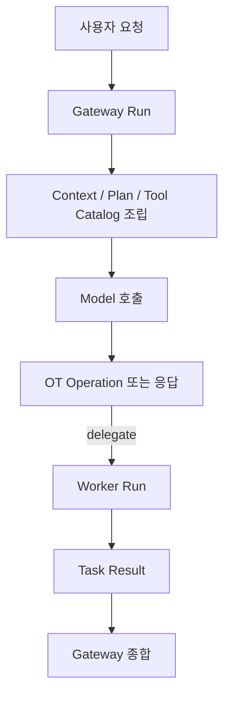

# 아키텍처

<<<<<<< HEAD
## 패키지 책임

- `internal/cli`: 엔트리포인트, 숨겨진 child-run 명령, TUI/exec/bootstrap 조합
- `internal/apiserver`: 로컬 HTTP API, SSE, 인증, discovery 파일 수명주기
- `internal/orchestrator`: 게이트웨이/워커 조정, run 상태 전이, iteration 루프, session maintenance 정책
- `internal/session`: 세션 transcript, metadata, task/context projection, compact/title 결과 적용, lineage
- `internal/config`: 설정 문서 codec, 경로 계산, repo integration, 공용 patch 적용
- `internal/tooling`: OT operation 검증, 승인 정책, 실행 dispatcher
- `internal/adapters`: provider transport, request 변환, stream decode
- `internal/workspace`: 테스트 워크스페이스 준비

## 현재 구조 원칙

런타임은 하나의 거대한 에이전트가 아니라 다음 조합으로 구성됩니다.

- 게이트웨이 조정자
- 워커 실행자
- OT 전용 모델 도구 표면

## 설계 패턴

현재 코드베이스는 아래 패턴을 최소 범위로 사용합니다.

- provider registry
  - provider 기본 endpoint, 표시 이름, 필수 필드를 한 곳에서 정의
- operation dispatcher
  - OT operation의 validation, approval, execution을 같은 registry로 연결
- reducer 스타일 UI 업데이트
  - TUI 모달과 키 입력 흐름을 상태 전이 중심으로 유지
- transport helper
  - provider별 HTTP transport는 유지하되 stream line scanner는 공용 helper로 공유

## 구현 분해 기준

- `internal/orchestrator`
  - bootstrap, prompt submission, run runtime, session bridge, snapshot/status를 파일 단위로 분리
- `internal/tooling`
  - OT operation registry, validation, approval, state execute, terminal execute를 분리
  - executor, external command helper, OT inspect/delegate/pointer 흐름을 분리
- `internal/cli`
  - command parsing, app bootstrap, interactive TUI, exec streaming, subagent handoff를 분리
- `internal/apiserver`
  - server lifecycle, discovery file, auth middleware, JSON response, SSE writer를 분리
- `internal/workspace`
  - provision, bootstrap sync, directory sync, env sanitize를 분리

## 흐름

## 설정 경계

- 설정 문서의 단일 소스 오브 트루스는 `orch.toml`
- provider 설정 필드는 `endpoint`, `model`, `api_key`, `reasoning`으로 통일
- 설정 파일은 `orch.toml`만 지원

## 구현 규칙

- transport는 orchestration 정책을 흡수하지 않습니다.
- orchestrator는 run 흐름, 상태 전이, title/compact/chat history summary 생성을 소유합니다.
- session은 provider client를 직접 알지 않고 저장과 투영, maintenance 결과 적용만 담당합니다.
- tooling은 도구 검증과 실행 정책만 다룹니다.
- config는 CLI, API, TUI가 공유하는 동일 patch 규칙을 사용합니다.
- provider 분기와 필수 설정 규칙은 registry에서만 정의합니다.
=======
## 설계 원칙

- 전송 계층은 입출력과 진입점만 담당합니다.
- 오케스트레이션 계층은 실행 흐름, 세션 전이, 승인 처리를 담당합니다.
- 도메인 계층은 식별자, 상태 모델, 불변 조건을 담당합니다.
- 어댑터 계층은 외부 제공자, 파일 시스템, 저장소, 렌더링과의 연결을 담당합니다.
- 런타임 계층은 프로세스 실행, 환경 변수, 작업 디렉터리, 종료 처리를 담당합니다.

## 패키지 책임

| 패키지 | 책임 |
| --- | --- |
| `internal/cli` | `orch` 엔트리포인트, 명령 파싱, 실행 시작 |
| `internal/tui` | 대화형 화면, 승인 UI, 세션 탐색, 설정 편집 |
| `internal/apiserver` | 로컬 API 서버, 토큰 인증, SSE 스트림 |
| `internal/orchestrator` | 실행 상태 전이, 역할별 흐름 제어, 작업 위임 |
| `internal/tooling` | `ot` 호출, 승인 분류, 외부 명령 실행 |
| `internal/session` | 세션 기록, 제목, compact, 작업 메타데이터 |
| `internal/store/sqlite` | SQLite 접근, 실행 이력과 기억 저장 |
| `internal/knowledge` | 기억 검색, 세션 회상, 스킬 승격 |
| `internal/workspace` | 실행 워크스페이스 준비, 자산 복사, 환경 정리 |
| `internal/adapters` | 제공자별 API 호출 |

## 런타임 경계

### 게이트웨이

- 사용자 요청을 해석합니다.
- 필요한 경우 워커 작업을 만듭니다.
- 작업 결과를 모아 최종 응답을 만듭니다.

### 워커

- 위임된 작업 계약만 수행합니다.
- 허용된 도구만 호출합니다.
- 결과를 구조화된 형태로 남깁니다.

### 저장소

- 세션 기록은 JSONL과 메타데이터 파일로 보존됩니다.
- 실행 메타데이터와 기억 관련 정보는 SQLite에도 함께 저장됩니다.

## 디렉터리 기준

- 전역 상태 루트: `ORCH_HOME`
- 전역 설정 파일: `ORCH_HOME/orch.env.toml`
- 프로젝트 설정 파일: `<repo>/orch.env.toml`
- 워크스페이스 상태: `ORCH_HOME/workspaces/<workspace-id>/`

세부 경로는 [실행 워크스페이스와 상태 디렉터리](./workspace-bootstrap.md)에서 설명합니다.
>>>>>>> cef7a8c (update)
