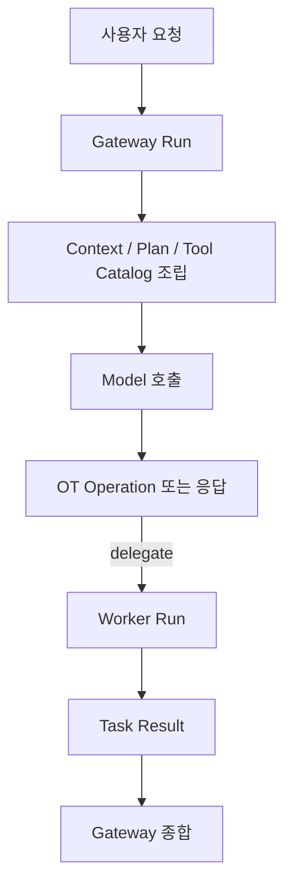

# 아키텍처

## 패키지 책임

- `internal/cli`: 엔트리포인트, 숨겨진 child-run 명령, TUI/exec/bootstrap 조합
- `internal/apiserver`: 로컬 HTTP API, SSE, 인증, discovery 파일 수명주기
- `internal/orchestrator`: 게이트웨이/워커 조정, run 상태 전이, iteration 루프, session maintenance 정책
- `internal/session`: 세션 transcript, metadata, task/context projection, compact/title 결과 적용, lineage
- `internal/config`: 설정 문서 codec, 경로 계산, repo integration, 공용 patch 적용
- `internal/tooling`: OT operation 검증, 승인 정책, 실행 dispatcher
- `internal/adapters`: provider transport, request 변환, stream decode
- `internal/workspace`: 테스트 워크스페이스 준비

## 현재 구조 원칙

런타임은 하나의 거대한 에이전트가 아니라 다음 조합으로 구성됩니다.

- 게이트웨이 조정자
- 워커 실행자
- OT 전용 모델 도구 표면

## 설계 패턴

현재 코드베이스는 아래 패턴을 최소 범위로 사용합니다.

- provider registry
  - provider 기본 endpoint, 표시 이름, 필수 필드를 한 곳에서 정의
- operation dispatcher
  - OT operation의 validation, approval, execution을 같은 registry로 연결
- reducer 스타일 UI 업데이트
  - TUI 모달과 키 입력 흐름을 상태 전이 중심으로 유지
- transport helper
  - provider별 HTTP transport는 유지하되 stream line scanner는 공용 helper로 공유

## 구현 분해 기준

- `internal/orchestrator`
  - bootstrap, prompt submission, run runtime, session bridge, snapshot/status를 파일 단위로 분리
- `internal/tooling`
  - OT operation registry, validation, approval, state execute, terminal execute를 분리
  - executor, external command helper, OT inspect/delegate/pointer 흐름을 분리
- `internal/cli`
  - command parsing, app bootstrap, interactive TUI, exec streaming, subagent handoff를 분리
- `internal/apiserver`
  - server lifecycle, discovery file, auth middleware, JSON response, SSE writer를 분리
- `internal/workspace`
  - provision, bootstrap sync, directory sync, env sanitize를 분리

## 흐름

## 설정 경계

- 설정 문서의 단일 소스 오브 트루스는 `orch.toml`
- provider 설정 필드는 `endpoint`, `model`, `api_key`, `reasoning`으로 통일
- 설정 파일은 `orch.toml`만 지원

## 구현 규칙

- transport는 orchestration 정책을 흡수하지 않습니다.
- orchestrator는 run 흐름, 상태 전이, title/compact/chat history summary 생성을 소유합니다.
- session은 provider client를 직접 알지 않고 저장과 투영, maintenance 결과 적용만 담당합니다.
- tooling은 도구 검증과 실행 정책만 다룹니다.
- config는 CLI, API, TUI가 공유하는 동일 patch 규칙을 사용합니다.
- provider 분기와 필수 설정 규칙은 registry에서만 정의합니다.
