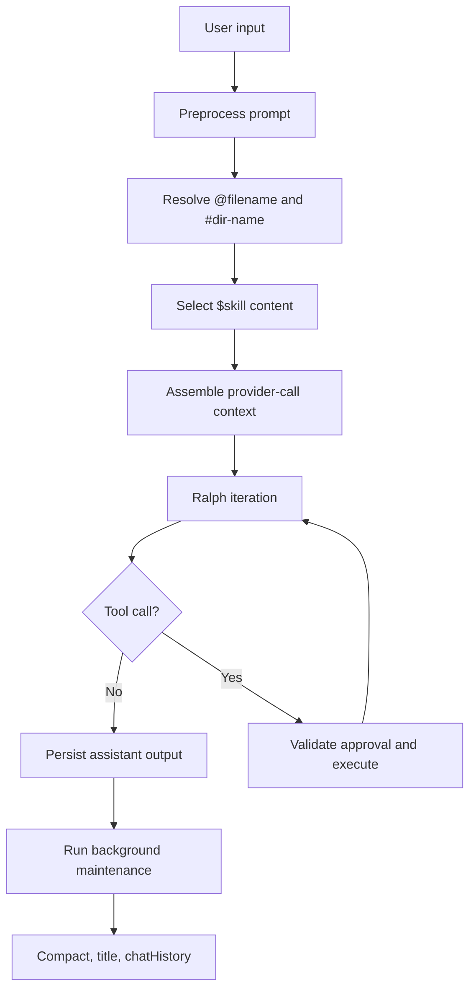

# Architecture

## Overview

`orch` is a workspace-local agent runner with four dominant runtime layers:

| Layer | Responsibility |
| --- | --- |
| `cmd/` | entrypoints and top-level process wiring |
| `internal/orchestrator/` | run lifecycle, prompt assembly, approvals, references, skill selection |
| `internal/session/` | JSONL transcript persistence, compact summaries, `chatHistory.md`, pointers |
| `internal/tooling/` | `exec` and `ot` policy, command inspection, execution |

The TUI and CLI both enter the same orchestrator/service surface.

## Runtime Ownership

| Package area | Owns |
| --- | --- |
| `internal/orchestrator` | Ralph loop, session switching, prompt preprocessing, reference resolution, skill selection |
| `internal/session` | session metadata, transcript reconstruction, compact pipeline, `chatHistory.md`, `ot-pointer` generation |
| `internal/tooling` | mode restrictions, approval classification, `ot`, `ot subagent`, `ot pointer` |
| `internal/tui` | Bubble Tea state, slash-command dropdown, history picker, chat rendering |
| `internal/workspace` | provisioning of `test-workspace` from runtime bootstrap assets |
| `internal/adapters` | Ollama / vLLM transport and tool-schema delivery |

## End-to-End Flow

## Prompt Assembly

Every provider call is built from:

- stable system prompt
- dynamic iteration context
- session context (`compact + post-compact raw records`)
- current user request

The dynamic iteration context is described in [prompting-context.md](prompting-context.md).

## Session Model

Session behavior is documented in [session-model.md](session-model.md). The short version:

- `.orch/sessions/*.jsonl` is the raw transcript source of truth
- compact summaries compress earlier history for reinjection
- `.orch/chatHistory.md` is a separate rolling digest for weaker sLLMs
- `ot-pointer://current?...` links compact/chatHistory paragraphs back to raw JSONL lines in the current session only

## Tooling Model

Tooling behavior is documented in [tooling.md](tooling.md). The short version:

- the model sees one structured tool: `exec`
- `exec` wraps curated `ot` commands and selected direct commands
- `Plan` mode is intentionally narrow
- `ReAct` mode can also use `ot pointer` and `ot subagent`

## Workspace Contract

`test-workspace` is provisioned runtime state, not source-of-truth repository content.

Provisioned inputs include:

- `PRODUCT.md`
- `AGENTS.md`
- `bootstrap/USER.md`
- `bootstrap/SKILLS.md`
- `bootstrap/skills/**`
- `tools/**`

`bootstrap/USER.md` is preserved across reprovisioning. The rest are refreshed from repo assets.

## TUI Notes

The TUI is not a shell clone. It is a session console with:

- slash-command discovery when typing `/`
- mode switching between `ReAct Deep Agent` and `Plan`
- reasoning visibility toggle
- session history picker
- explicit `/clear`, `/compact`, `/exit` semantics

## Related Documents

- [session-model.md](session-model.md)
- [tooling.md](tooling.md)
- [prompting-context.md](prompting-context.md)
