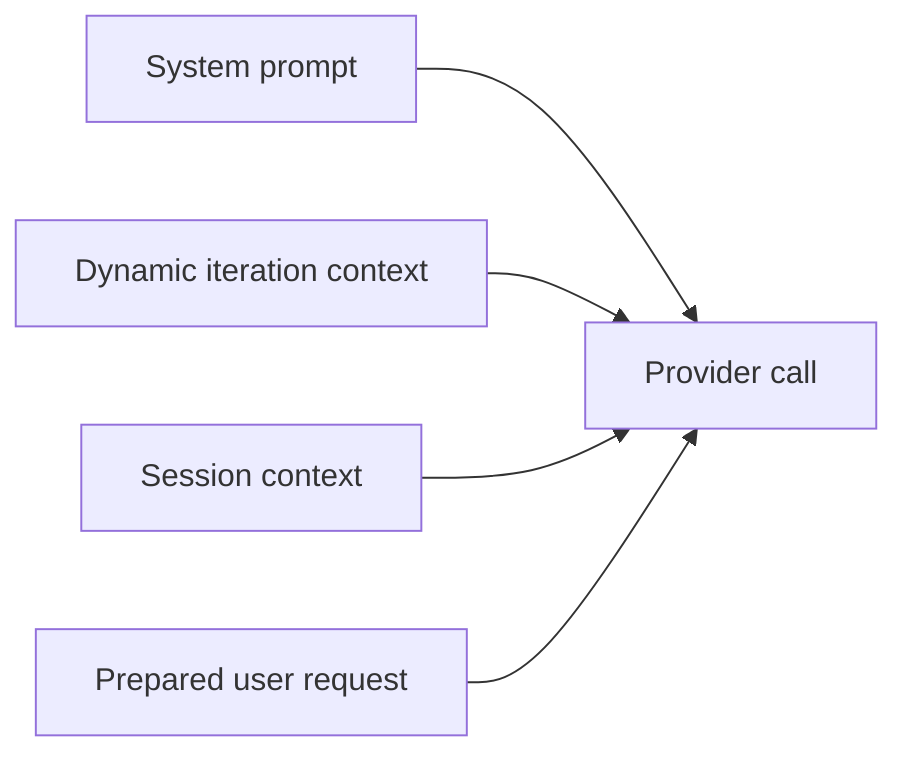

# Prompting Context

## Provider-Call Composition

Every provider call is rebuilt from live repository state and session state.

## Dynamic Iteration Context

The dynamic iteration block may include:

- current working directory
- `PRODUCT.md`
- `AGENTS.md`
- `bootstrap/USER.md`
- `bootstrap/SKILLS.md`
- concise mode-aware tool summary
- selected skill content
- resolved `@filename` / `#dir-name` references
- `.orch/chatHistory.md`
- active plan or current draft plan

## References

### `@filename`

- workspace-scoped
- hidden files are included
- rendered as markdown-style links
- ambiguity is surfaced instead of silently guessed

### `#dir-name`

- directory-scoped variant of the same reference system
- uses the same cached basename index and rank ordering

## Skills

### Skill Index

The canonical index is:

- `bootstrap/SKILLS.md`

Skill content lives under:

- `bootstrap/skills/<skill-name>/...`

### Explicit Selection

When the user mentions `$<skill-name>`:

- the skill is validated against the current bootstrap skill set
- matching skill content is injected every provider call
- unknown skills fail clearly instead of being ignored

## chatHistory vs Compact

| Context source | Why it exists |
| --- | --- |
| compact + post-compact raw records | efficient session reinjection |
| `.orch/chatHistory.md` | rolling continuity support for weaker sLLMs |

These are complementary, not interchangeable.

## Tool Summary

The model receives:

- structured tool schema in `ChatRequest.Tools`
- concise text tool summary in the dynamic context

The summary is derived from the same source as the structured tool catalog so the two cannot drift.
