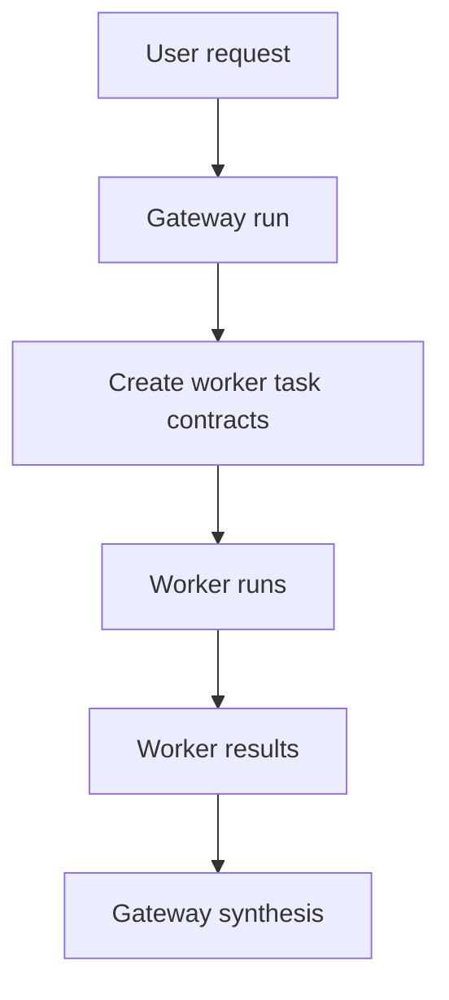

# System Overview

`orch` is now organized as a two-layer agent system:

- gateway for interpretation, delegation, and synthesis
- worker for bounded execution

## Core Flow

## Key Runtime Properties

- OT-only model-facing tool contract
- role-specific prompt loading
- dynamic evidence loading
- compact-based continuity
- child-session lineage for delegated work
