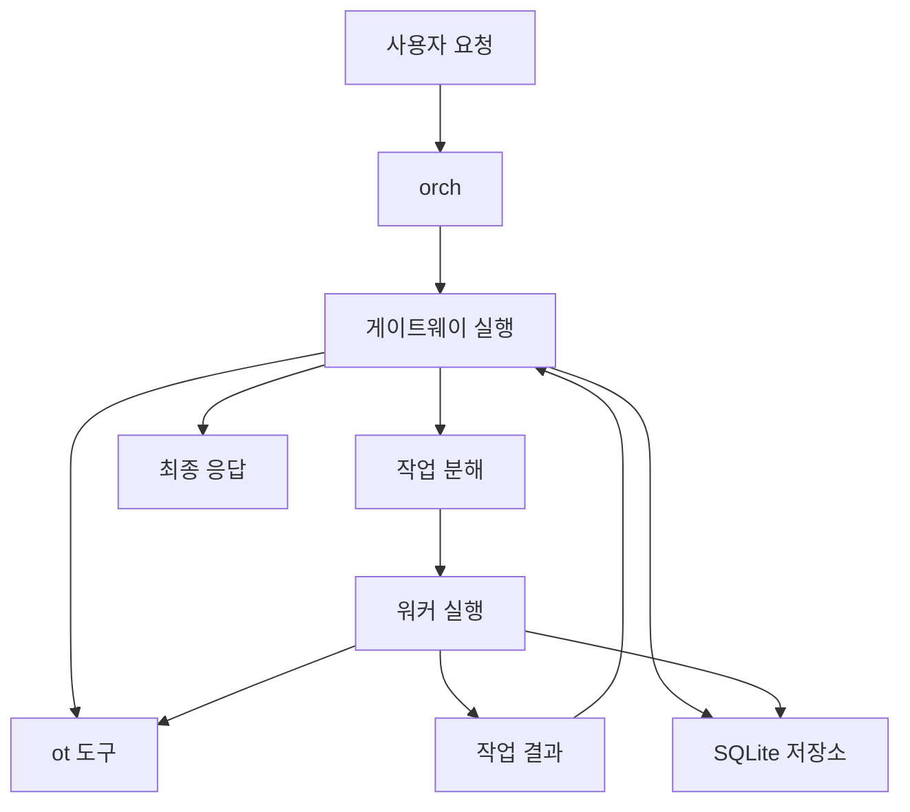

# 시스템 개요

## 개요

`orch`는 로컬 저장소 작업을 대상으로 하는 2계층 실행 시스템입니다.  
요청을 해석하고 작업을 조정하는 게이트웨이와, 실제 작업을 제한된 범위에서 수행하는 워커가 함께 동작합니다.

대화형 실행은 TUI를 중심으로 이뤄지고, 단발성 실행은 CLI로 처리합니다.  
세션, 작업 결과, 기억, 스킬 정보는 로컬 저장소에 남아 다음 실행의 기반이 됩니다.

## 실행 흐름

## 주요 구성 요소

| 구성 요소 | 역할 |
| --- | --- |
| `orch` CLI | 기본 실행 진입점, 설정 조회·수정, 세션 이력 복원 |
| TUI | 대화형 실행, 승인 처리, 세션 탐색, 설정 화면 |
| 게이트웨이 | 요청 해석, 작업 위임, 최종 응답 조합 |
| 워커 | 위임된 작업만 수행하고 결과를 구조화해 반환 |
| `ot` | 파일 읽기, 검색, 쓰기, 패치, 점검을 담당하는 도구 |
| SQLite 저장소 | 실행 이력, 세션 메타데이터, 기억, 스킬 저장 |

## 운영 특성

- 기본 CLI 진입점은 `orch <request>`입니다.
- 계획 실행은 `orch exec --mode plan`으로 수행합니다.
- 대화형 세션 중에는 인증 토큰이 걸린 로컬 API 서버가 함께 열립니다.
- 상태 디렉터리는 `ORCH_HOME` 아래에 모입니다.
- 프로젝트별 설정은 전역 설정을 덮어쓸 수 있습니다.
