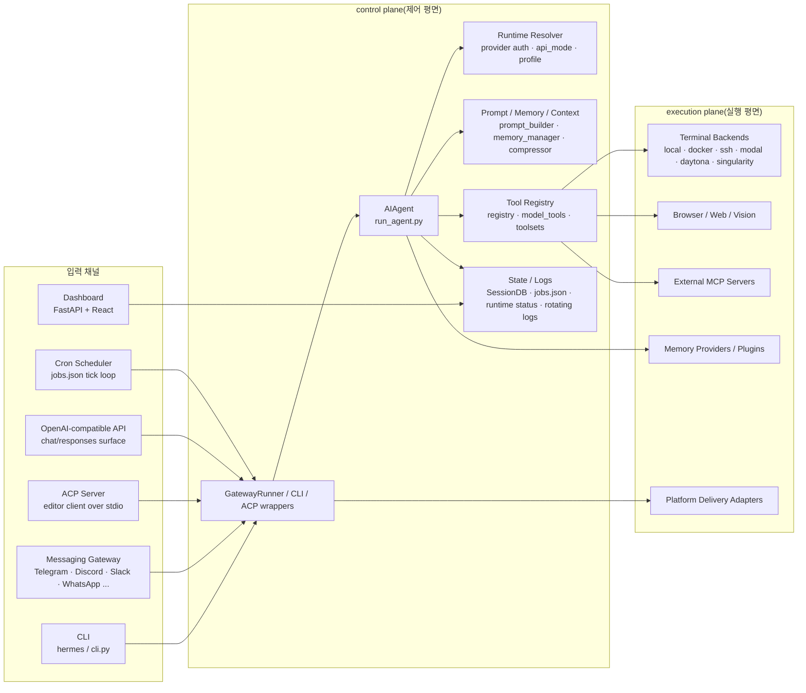

# Hermes Agent 시스템 설계

이 문서는 `hermes-agent`의 `runtime(실행 환경)`를 시스템 설계 관점에서 설명한다. 핵심 결론은 단순하다. Hermes는 여러 입력 채널이 하나의 공통 `agent core(에이전트 코어)`를 공유하고, 그 코어가 상태 저장 계층과 도구 실행 계층을 매개로 외부 세계를 조정하는 구조다. CLI, 메시징 `gateway(게이트웨이)`, `ACP`, HTTP API, 웹 대시보드, `cron`, `MCP server(MCP 서버)`가 각각 별도 제품처럼 보일 수 있지만, 실제로는 대부분 `AIAgent(AI 에이전트)` 또는 그 주변 제어 계층에 연결된 진입점이다.

이 설계를 이해할 때는 일반 웹 서버처럼 “요청 하나를 받아 응답 하나를 돌려주는 구조”로 보면 안 된다. Hermes는 장기 세션, 승인 대기, 도구 부작용, 압축, 기억 동기화, 로그와 상태 노출까지 다루는 장기 실행 중심 `control plane(제어 평면)`에 더 가깝다.

## 이 문서가 다루는 범위

여기서는 다음 질문에 답한다.

- 런타임에 어떤 조각이 뜨고 누가 무엇을 맡는가
- 요청이 어디로 들어와 어떤 경로로 모델과 도구를 거치는가
- 상태와 로그가 어느 저장소에 기록되는가
- 어떤 지점이 신뢰 경계이며 어떤 입력이 비신뢰 표면인가
- 이 설계가 만드는 운영상 장점과 부담은 무엇인가

## 전체 런타임 형태

Hermes의 상위 구조는 아래 그림으로 보는 편이 가장 직관적이다.

이 그림에서 중요한 점은 두 가지다.

- 제어는 거의 모두 `AIAgent`와 그 주변 래퍼 계층에 모인다.
- 실제 부작용은 터미널, 파일, 브라우저, 메시징 전송, 외부 `MCP` 서버 쪽에서 난다.

따라서 Hermes의 중심 경계는 “입력 채널 대 코어”보다 “코어 대 부작용 실행 계층”에 가깝다.

## 런타임 구성요소와 책임

주요 구성요소를 책임 중심으로 정리하면 아래와 같다.

| 구성요소 | 대표 파일 | 핵심 책임 |
|---|---|---|
| 공통 에이전트 코어 | `run_agent.py` | 프롬프트 조립, 모델 호출, 도구 실행, 재시도, 압축, 저장 |
| 모델 런타임 해석 | `hermes_cli/runtime_provider.py` | `provider(모델 제공자)`, `api_mode`, 자격증명 풀, 커스텀 엔드포인트 해석 |
| 문맥/기억 계층 | `agent/prompt_builder.py`, `agent/context_compressor.py`, `agent/memory_manager.py` | 정체성 프롬프트, 프로필 기억, 작업 공간 지침, 스킬 스냅샷, 압축, 장기 기억 |
| 도구 레지스트리 | `tools/registry.py`, `model_tools.py`, `toolsets.py` | 도구 발견, 스키마 노출, 도구 묶음 해석 |
| 터미널 실행 | `tools/terminal_tool.py`, `tools/environments/*` | 로컬/원격 명령 실행과 프로세스 관리 |
| 세션 영속화 | `hermes_state.py` | SQLite, `FTS5`, 세션 계보, 비용과 토큰 통계 |
| 메시징 허브 | `gateway/run.py`, `gateway/platforms/*` | 플랫폼 이벤트 정규화, 세션 라우팅, 승인·인터럽트 처리 |
| 자동화 | `cron/jobs.py`, `cron/scheduler.py` | 예약 작업 정의, due 판단, 결과 전달 |
| 편집기 브리지 | `acp_adapter/*` | JSON-RPC 기반 세션 생성, 스트리밍 이벤트, 권한 브리지 |
| 웹 대시보드 | `hermes_cli/web_server.py`, `web/src/*` | 상태, 로그, 세션, 설정, 키, 분석 운영 UI |
| 외부 노출 서버 | `gateway/platforms/api_server.py`, `mcp_serve.py` | HTTP 기반 에이전트 표면과 Hermes 자체 도구 노출 |

이 표에서 보이듯 Hermes는 마이크로서비스 묶음이 아니라 “하나의 Python 기반 제어 프로세스에 여러 인터페이스를 겹친 구조”에 더 가깝다.

## `control plane(제어 평면)`과 `execution plane(실행 평면)`

Hermes를 해석할 때 가장 중요한 분리는 제어와 실행이다.

### 제어 평면

제어 평면은 “무엇을 할지 결정하고, 어떤 상태로 기록하고, 어느 인터페이스로 결과를 돌려줄지 조정하는 층”이다.

- `AIAgent`
- `GatewayRunner`
- 런타임 제공자 해석기
- 프롬프트/기억/압축 계층
- 세션 DB와 런타임 상태 기록기

### 실행 평면

실행 평면은 “실제로 외부 세계와 접촉해 부작용을 내는 층”이다.

- 터미널 백엔드와 파일 조작
- 브라우저, 웹 검색, 비전, 음성 도구
- 외부 `MCP` 서버
- 메시징 송수신 어댑터
- 외부 기억 제공자

쉽게 말해 제어 평면은 판단과 라우팅을 맡고, 실행 평면은 손발을 맡는다. Hermes의 중요한 장점 중 하나는 이 둘을 구분한 채 실행 위치를 바꿀 수 있다는 점이다.

## 요청은 어떻게 들어오는가

입력면은 많지만 내부로 들어오면 비교적 비슷한 형태로 정규화된다.

### 1. `CLI(명령행 인터페이스)`

`hermes_cli/main.py`는 프로필, 설정, 로깅, 모델 선택을 먼저 해석한 뒤 대화 루프로 들어간다. 가장 단순한 경로이기 때문에 Hermes의 기본 동작을 이해하는 기준선 역할을 한다.

### 2. 메시징 `gateway(게이트웨이)`

`gateway/platforms/*`의 각 어댑터는 외부 플랫폼 이벤트를 공통 `MessageEvent(메시지 이벤트)`로 변환해 `GatewayRunner._handle_message()`로 보낸다. 플랫폼은 달라도 세션 키 계산, 권한 검사, 인터럽트 처리, 승인 흐름은 공통 제어 계층에서 처리된다.

### 3. `ACP(에이전트 클라이언트 프로토콜)`

`acp_adapter/server.py`는 편집기와 Hermes 사이의 JSON-RPC 통신을 감싼다. 이 프로토콜은 세션 생성, 프롬프트 전송, 업데이트 스트리밍, 권한 요청을 교환하는 구조이고, Hermes는 이를 동기 코어에 맞게 재포장한다.

### 4. `OpenAI-compatible API(오픈AI 호환 API)`

`gateway/platforms/api_server.py`는 HTTP 요청을 받아 OpenAI 형식의 `/v1/models`, `/v1/chat/completions`, `/v1/responses` 경로로 노출한다. 하지만 내부적으로는 독립 제품보다 게이트웨이 변형에 가깝고, 세션 DB와 같은 코어 자산을 재사용한다.

### 5. 웹 대시보드

`hermes_cli/web_server.py`는 FastAPI 백엔드와 React 프런트엔드를 붙여 상태, 세션, 로그, 분석, 설정, 환경 변수, `cron`, 스킬을 조작하게 한다. 이 표면은 대화용이 아니라 운영용이다. 따라서 게이트웨이나 API 서버와 달리 “에이전트와 대화”보다 “에이전트를 관리”하는 역할이 강하다.

### 6. `cron(크론)`

`cron/scheduler.py`는 시간 조건이 맞는 작업을 찾아 새 세션의 `AIAgent`를 실행한다. 대화형 입력은 아니지만, 코어 입장에서는 또 하나의 비대화형 요청 원천이다.

## 요청이 내부에서 이동하는 경로

표면이 달라도 핵심 경로는 대체로 동일하다.

1. 입력 채널이 요청을 내부 이벤트 형태로 정규화한다.
2. 세션 키 또는 세션 ID를 정한다.
3. 프로필, 제공자, 도구 묶음, 권한 상태를 해석한다.
4. `AIAgent`가 시스템 지시층과 대화 이력을 조립한다.
5. 모델 응답을 받아 텍스트와 `tool call(도구 호출)`을 판별한다.
6. 도구가 필요하면 순차 또는 병렬로 실행하고 결과를 다시 히스토리에 넣는다.
7. 최종 응답과 메타데이터를 세션 저장소, 로그, 원래 표면에 반영한다.

이 흐름에서 중요한 것은 “한 번의 입력이 모델 한 번 호출로 끝나지 않는다”는 점이다. Hermes는 모델-도구-모델을 여러 번 왕복시키는 `orchestrator(오케스트레이터)`다.

## 모델 상호작용 경계

Hermes는 모델과 런타임의 경계를 비교적 분명하게 둔다.

### 모델이 맡는 것

- 자연어 해석
- 도구 선택과 인자 생성
- 중간 요약과 최종 응답 작성
- 일부 저위험 판단 보조

### 모델이 직접 맡지 않는 것

- 실제 파일 수정과 셸 실행
- 위험 명령 승인
- 세션 저장과 검색 인덱싱
- 플랫폼 권한 확인
- 로그 기록과 상태 API 갱신

또한 모델 계층은 세 가지 API 모드를 공통 내부 표현으로 맞춘다.

- `chat_completions(채팅 완성 API)`
- `codex_responses(응답 API)`
- `anthropic_messages(Anthropic 메시지 API)`

이 구조는 공급자 교체에 강하지만, 내부 변환 계층이 두꺼워지는 대가를 치른다.

## 도구 실행 경로

도구 실행은 레지스트리와 실행 백엔드가 만나는 지점이다.

### 레지스트리 계층

`tools/registry.py`는 도구가 import 시점에 스스로 등록되게 만든다. `model_tools.py`는 그 결과를 모델용 스키마로 바꾸고, `toolsets.py`는 표면별 권한 집합을 해석한다. 새 도구를 붙이기 쉬운 구조지만, import-time side effect(임포트 시점 부작용)에 의존하기 때문에 추적성은 약간 떨어진다.

### 디스패치 계층

모델이 도구 호출을 반환하면 `run_agent.py`는 이를 순차 경로와 병렬 경로로 나눠 보낸다. 세션 상태를 건드리거나 상호작용이 필요한 도구는 직렬화하고, 독립성이 높은 읽기성 작업만 제한적으로 병렬화한다.

### 실행 백엔드 계층

특히 `terminal(터미널 도구)`는 여러 실행 위치를 숨기는 두꺼운 추상화다.

- local: 가장 단순하고 빠르지만 호스트와 가장 가깝다.
- Docker / Singularity: 격리와 재현성 중심
- SSH: 원격 서버 실행
- Modal / Daytona: 지속형 또는 원격 작업 환경 실행

이 덕분에 제어 평면은 “명령 실행”이라는 동일한 능력을 유지하면서도 실제 부작용 위치를 교체할 수 있다.

## 상태 흐름: 무엇이 어디에 저장되는가

Hermes의 상태는 하나의 저장소에 몰리지 않는다. 이것이 운영 중심 시스템으로서의 성격을 강하게 보여 준다.

### 정규 세션 저장소

`hermes_state.py`의 SQLite `SessionDB(세션 데이터베이스)`는 중심 기록 저장소다.

- 세션 메타데이터
- 전체 메시지 히스토리
- `FTS5` 검색
- 세션 제목과 계보
- 토큰과 비용 메타데이터

### 게이트웨이 라우팅 상태

메시징 표면은 SQLite 외에 플랫폼별 세션 키, 홈 채널, 진행 상태를 추가로 관리한다. 이는 검색보다 라우팅과 재전달을 위한 상태다.

### 자동화 상태

`cron/jobs.py`가 다루는 `jobs.json`은 스케줄, 다음 실행 시각, 반복 여부, 전달 타깃을 보관한다.

### 장기 기억과 확장 상태

프로필 루트 아래에는 기억, 사용자 설치 스킬, 플러그인 상태가 저장된다. 이 계층은 세션 로그와 별도로 다음 세션에도 다시 주입될 수 있는 장기 상태를 담당한다.

### 로그와 운영 상태

`hermes_logging.py`는 `agent.log`, `errors.log`, `gateway.log`를 회전 저장하고 세션 태그를 기록한다. `gateway.status`와 웹 대시보드 API는 현재 PID, 플랫폼 연결 상태, 활성 세션 수 같은 런타임 상태를 별도로 노출한다.

이 다중 저장 구조는 복잡하지만 이유가 있다. 검색, 라우팅, 자동화, 장기 기억, 운영 관측은 요구 사항이 달라 하나의 저장소로 모두 해결하기 어렵기 때문이다.

## 외부 인터페이스와 통합 지점

Hermes가 외부와 만나는 주요 경계는 아래와 같다.

| 통합 지점 | 방식 | 코드상 근거 | 설계 의미 |
|---|---|---|---|
| 메시징 플랫폼 | 플랫폼 SDK + 이벤트 루프 | `gateway/platforms/*` | 사람과의 장기 대화 표면 |
| 편집기 | `ACP` JSON-RPC | `acp_adapter/*` | 코드 워크스페이스 안으로 세션을 끌어들임 |
| HTTP 클라이언트 | OpenAI 호환 REST | `api_server.py` | 기존 LLM 클라이언트와의 얕은 호환 |
| 외부 도구 서버 | `MCP` stdio / HTTP | `tools/mcp_tool.py` | 외부 도구 생태계를 Hermes 안으로 편입 |
| 웹 브라우저 | Node 기반 브라우저 자동화 | `tools/browser_tool.py` | 텍스트 외 상호작용 표면 확보 |
| 원격 실행 백엔드 | Docker / SSH / 클라우드 SDK | `tools/environments/*` | 제어와 부작용 위치 분리 |
| 운영 콘솔 | FastAPI + React | `hermes_cli/web_server.py`, `web/src/*` | 상태, 로그, 설정, 키를 한곳에서 조작 |

이 중 실제 제품 차별점으로 이어지는 것은 게이트웨이, `ACP`, `MCP`, 원격 실행 백엔드다. 단순 HTTP 호환은 편의 기능에 가깝지만, 앞의 네 축은 Hermes의 운영 모델 자체를 바꾼다.

## 신뢰 경계와 비신뢰 입력

Hermes의 위험 표면은 입력 종류별로 보는 편이 명확하다.

| 입력/경계 | 들어오는 것 | 주요 위험 | 방어 계층 |
|---|---|---|---|
| 메시징 플랫폼 | 사용자 메시지, 첨부물, 제어 명령 | 무단 사용자, 승인 우회, 세션 오염 | 허가 목록, 페어링, 플랫폼별 인증 |
| CLI | 로컬 사용자 입력 | 파괴적 명령 실행 | 승인 시스템, 작업 디렉터리 검증 |
| 작업 공간 지침층 | 프로필 기억, 프로젝트 지침, 사용자 스킬 | `prompt injection` | 스캔과 정규화, 프롬프트 계층 분리 |
| 파일 경로 | 읽기/쓰기/패치 대상 | 경로 이탈, 민감 파일 덮어쓰기 | `path_security`, 허용 디렉터리 검사 |
| HTTP API | 채팅/응답 요청 | 비인가 사용, 무제한 입력 | Bearer 키, 바인드 제한, CORS |
| 웹 대시보드 | 설정/환경 변수/로그 조회 | 민감값 노출 | 로컬 전용 CORS, 부팅 시 생성되는 세션 토큰 |
| 외부 `MCP` 서버 | 동적 도구, 프롬프트, 리소스 | 이름 충돌, 권한 과다, 설명 기반 인젝션 | 접두어, 환경 변수 필터링, 설명 스캔 |
| 원격 실행 백엔드 | 셸 명령과 파일 조작 | 호스트 오염, 자격증명 노출 | 격리 백엔드, per-profile HOME, 환경 변수 제한 |

Hermes의 흥미로운 점은 단일 `sandbox`에 모든 책임을 맡기지 않는다는 것이다. 대신 사용자 권한, 프롬프트, 파일 경로, 셸 명령, 플랫폼 인증, 실행 위치, 로그 마스킹 같은 여러 작은 경계를 겹친다.

## 권한, 경로, 승인, 인증은 누가 맡는가

이 부분은 역할을 분리해서 보는 편이 낫다.

### 사용자 권한

메시징 플랫폼 접근 제어는 게이트웨이가 맡는다. 누가 봇에게 말을 걸 수 있는지의 문제다.

### 경로 권한

파일 도구와 터미널 도구가 작업 디렉터리와 경로 이탈을 막는다. 어디를 건드릴 수 있는지의 문제다.

### 위험 명령 승인

`tools/approval.py`가 위험 패턴을 검사하고, CLI와 게이트웨이가 각각 동기/비동기 승인 UI를 제공한다. 무엇을 실행해도 되는지의 문제다.

### API·대시보드 인증

API 서버는 선택적 Bearer 키를 사용하고, 웹 대시보드는 부팅 시 생성한 일회성 세션 토큰을 민감 API에 요구한다. 누가 상태와 비밀값을 조회하거나 바꿀 수 있는지의 문제다.

### 실행 위치 격리

터미널 백엔드와 컨테이너 이미지는 명령이 어디에서 실행되는지를 결정한다. 사고 반경을 어디까지 허용할지의 문제다.

## 동기와 비동기가 만나는 지점

Hermes의 런타임을 어렵게 만드는 핵심 중 하나는 동기 코어와 비동기 표면의 혼합이다.

- `AIAgent`는 기본적으로 동기 루프다.
- 게이트웨이는 비동기 이벤트 기반이다.
- `ACP`도 비동기 JSON-RPC I/O를 기대한다.
- 일부 도구와 `MCP` 클라이언트는 자체 이벤트 루프를 갖는다.
- 병렬 도구 실행과 하위 에이전트 위임은 스레드 풀을 쓴다.

즉 Hermes는 전면 `async(비동기)` 제품이 아니라, 동기 코어를 중심에 두고 필요한 지점에서만 이벤트 루프와 스레드를 브리지하는 구조다. 기존 Python 도구 생태계와 잘 맞지만, 취소, 승인, 스트리밍, 세션 중단을 다루는 비용은 커진다.

## 배포 형상과 운영 토폴로지

Hermes의 배포 형태는 코드상 크게 세 가지로 읽을 수 있다.

### 로컬 단일 실행

사용자가 로컬에서 `hermes`를 실행하고 필요할 때만 대시보드나 게이트웨이를 띄우는 형태다. 가장 단순하지만 장기 자동화에는 약하다.

### 자가 운영 허브

게이트웨이와 `cron`을 백그라운드 프로세스로 유지하고, Telegram·Discord 같은 외부 채널에서 Hermes와 상호작용하는 형태다. 이 경우 Hermes는 개인용 작업 허브처럼 동작한다.

### 혼합형 실행

제어 프로세스는 한 곳에 두고, 셸 명령과 파일 작업은 Docker, SSH, Modal, Daytona 같은 원격 백엔드로 보낸다. 이 경우 Hermes는 제어와 실행이 분리된 하이브리드 구조가 된다.

Dockerfile, Nix 플래이크, Homebrew 패키징, 프로필별 `HERMES_HOME` 처리는 Hermes가 단일 노트북 사용을 넘는 배포 형태를 꽤 진지하게 고려하고 있음을 보여 준다.

## 런타임 강점

- 표면이 많아도 코어 행동이 크게 갈라지지 않는다.
- 세션 저장과 로그가 런타임에 깊게 통합돼 운영 관측성이 좋다.
- 실행 위치를 바꿔도 상위 오케스트레이션을 재작성할 필요가 없다.
- 승인, 경로 보안, 토큰 기반 대시보드 보호처럼 현실적인 안전 장치가 코드에 내려와 있다.

## 런타임 병목과 취약 지점

- 중심 코어가 너무 많은 정책을 떠안아 작은 변경도 영향 범위가 넓다.
- 제공자, 플랫폼, 백엔드 조합이 많아질수록 회귀 표면이 폭증한다.
- 상태 저장소가 여러 종류라 운영 디버깅이 단순하지 않다.
- 동기 코어와 비동기 표면의 브리지가 취소·스트리밍·승인 흐름을 어렵게 만든다.

## 왜 이 설계가 제품 차별점으로 보이는가

Hermes의 설계에서 우연한 구현 디테일이 아니라 실제 차별화로 이어지는 선택은 세 가지다.

- 메시징, IDE, HTTP, `MCP`, 자동화를 하나의 세션 코어로 통합한 점
- 장기 세션 유지에 필요한 압축, 검색, 계보 추적, 기억 계층을 코어로 끌어온 점
- 제어 위치와 실행 위치를 분리해 운영자가 배포 형태를 선택할 수 있게 한 점

이 세 축은 단순한 챗봇이나 얇은 코드 에이전트보다 Hermes를 훨씬 운영 중심 제품으로 만든다.

## 요약

Hermes의 `system design(시스템 설계)`은 여러 입력 채널, 단일 `agent core(에이전트 코어)`, 자체 등록형 `tool registry(도구 레지스트리)`, 다중 상태 저장, 그리고 로컬/원격 실행 분리를 축으로 한다. 제어 평면은 `AIAgent`, 런타임 해석, 프롬프트/기억/압축, 세션 저장이 맡고, 실행 평면은 터미널·파일·브라우저·`MCP`·메시징 전달이 맡는다. 이 구조는 복잡하지만 의도는 선명하다. 여러 채널과 여러 환경에 흩어진 실행 능력을 하나의 지속적 운영 주체로 묶으려는 것이다.
