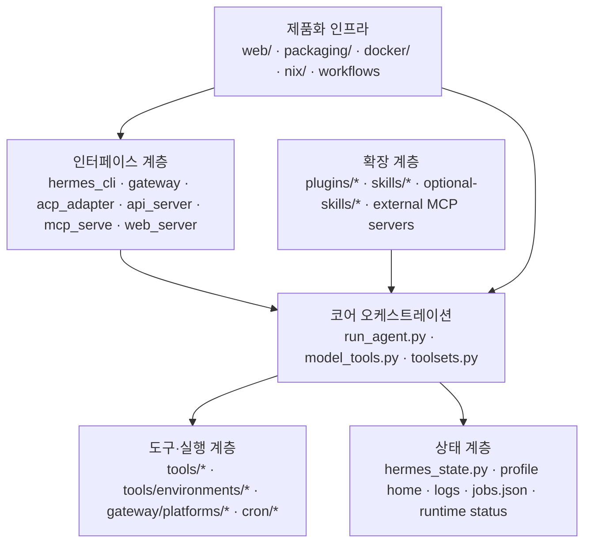

# Hermes Agent 소프트웨어 아키텍처

이 문서는 `hermes-agent` 저장소를 `software architecture(소프트웨어 아키텍처)` 관점에서 다시 맵핑한다. 결론부터 말하면 Hermes의 저장소 구조는 겉보기보다 일관성이 있다. 핵심은 “인터페이스 계층은 다양하지만 중심 오케스트레이션과 상태 관리 축은 소수의 큰 Python 모듈에 집중되고, 확장성은 `tool`, `skill`, `plugin`, `MCP`, `memory provider(기억 제공자)`, `context engine(문맥 엔진)` 같은 제한된 접점으로 배분된다”는 점이다. 즉 완전히 분산된 모듈형 프레임워크라기보다, 강한 코어 위에 의도적으로 열린 주변부를 붙인 구조다.

이 문서의 목적은 디렉터리 목록을 반복하는 것이 아니다. 어떤 패키지 경계가 진짜 런타임 경계와 맞물리는지, 무엇이 교체 가능하고 무엇이 사실상 코어에 묶여 있는지, 그리고 그 차이가 유지보수에 어떤 영향을 주는지 설명하는 데 있다.

## 이 문서가 보는 기준

이 문서는 저장소를 다음 기준으로 읽는다.

- 저장소 경계와 런타임 경계가 얼마나 일치하는가
- 어떤 추상화가 실제로 교체 가능하고, 어떤 것은 명목상 분리만 되어 있는가
- 확장 지점이 유지보수 비용을 줄이는가, 아니면 복잡도를 숨기기만 하는가
- 패키징, 배포, 테스트, 로그가 코어 구조를 어떻게 보조하는가

## 저장소의 상위 계층 구도

Hermes 저장소는 아래 여섯 계층으로 읽는 것이 가장 자연스럽다.

이 그림은 실제 호출 순서를 그대로 그린 것은 아니지만, 유지보수 관점에서 무엇이 중심이고 무엇이 주변인지 보여 준다. Hermes의 복잡성은 인터페이스 수보다 “코어가 얼마나 많은 핵심 동작을 붙잡고 있는가”에서 나온다.

## 계층별 해석

### 1. 인터페이스 계층

인터페이스 계층은 사용자가 Hermes를 만나는 입구다.

- `hermes_cli/`, `cli.py`: 대화형 CLI와 각종 하위 명령
- `gateway/`: 메시징 플랫폼 허브
- `acp_adapter/`: 편집기용 `ACP`
- `gateway/platforms/api_server.py`: `OpenAI-compatible API`
- `mcp_serve.py`: Hermes 자체를 외부 `MCP client(MCP 클라이언트)`에 노출
- `hermes_cli/web_server.py`, `web/`: 운영 대시보드

이 계층은 사용자 경험 면에서는 서로 다르지만, 대부분 공통 코어에 의존하는 얇은 래퍼다. 즉 표면 다양성이 곧바로 아키텍처 다원성을 뜻하지는 않는다.

### 2. 코어 오케스트레이션 계층

이 계층이 Hermes의 진짜 중심이다.

- `run_agent.py`
- `model_tools.py`
- `toolsets.py`
- 일부 `agent/*` 모듈

실제 턴 생명주기, 모델 호출, 압축, 재시도, 도구 디스패치, 세션 저장이 여기에서 결합된다. 중앙 파일이 큰 이유는 정책과 예외가 이 층에 집중되기 때문이다.

### 3. 도구·실행 계층

`tools/*`와 `tools/environments/*`는 Hermes의 능력 표면을 구성한다. 파일 조작, 셸 실행, 브라우저, 세션 검색, 기억, 위임, 메시지 전송, `MCP` 브리지, 승인 시스템이 모두 여기 있다. 이 계층은 코어에 의해 호출되지만 실제 부작용은 여기서 난다.

### 4. 상태 계층

`hermes_state.py`, 프로필 루트 아래 저장소, 로그 디렉터리, `cron/jobs.json`, 런타임 상태 파일이 속한다. Hermes는 상태를 단일 데이터베이스로 몰지 않고 목적별 파일/SQLite 혼합 구조를 택한다.

### 5. 확장 계층

이 계층이 Hermes를 프레임워크처럼 보이게 만든다.

- `plugins/`
- `skills/`
- `optional-skills/`
- 외부 `MCP` 서버

하지만 무제한 확장은 아니다. 실제로는 코어가 허용한 인터페이스와 정책 안에서만 움직인다.

### 6. 제품화 인프라

이 부분은 종종 과소평가되지만 구조적으로 중요하다.

- `web/`: React 기반 운영 대시보드
- `packaging/`, `setup-hermes.sh`: 설치와 배포 경로
- `Dockerfile`, `docker/`: 컨테이너 실행과 격리 기본 경로
- `nix/`, `flake.nix`: 선언적 개발·빌드 경로
- `.github/workflows/*`: 테스트, Docker 배포, Nix, 공급망 감사

즉 Hermes는 라이브러리도, CLI 단일 앱도 아니고, 운영 콘솔과 배포 체계를 포함한 제품 저장소다.

## 저장소 주요 경로와 역할

| 경로 | 역할 | 아키텍처적 의미 |
|---|---|---|
| `run_agent.py` | 공통 에이전트 루프 | 코어 정책의 집중점 |
| `agent/` | 프롬프트, 압축, 기억, 모델 메타데이터 | 코어를 보조하는 핵심 동작 계층 |
| `tools/` | 능력 구현 | 실행 평면의 주된 구현 위치 |
| `gateway/` | 플랫폼 허브와 세션 라우팅 | 멀티채널 제어 허브 |
| `acp_adapter/` | 편집기 브리지 | 동기 코어를 외부 IDE로 노출 |
| `cron/` | 예약 실행 | 비대화형 자동화 모듈 |
| `hermes_cli/` | 엔트리포인트, 설정, 모델 선택, 로그, 대시보드 | 운영 면의 중심 |
| `plugins/` | 도구/훅/제공자형 확장 | 코드 수준 확장 경계 |
| `skills/`, `optional-skills/` | 문서 기반 확장 | 저비용 기능 확장 경계 |
| `web/` | 운영 UI | 관측성과 설정 변경의 관리 표면 |
| `packaging/`, `docker/`, `nix/`, `.github/workflows/` | 패키징과 릴리스 | 제품화 성숙도와 운영 가정의 증거 |

## 핵심 추상화와 실제 역할

### `AIAgent(AI 에이전트)`

Hermes 아키텍처의 사실상 `application service(응용 서비스)`다. 프롬프트 조립, 모델 호출, 도구 실행, 압축, 저장을 모두 통제한다. 강력하지만 책임이 과도하게 몰려 있어 가장 중요한 자산이자 가장 큰 병목이 된다.

### `ToolRegistry(도구 레지스트리)`

`tools/registry.py`는 가장 실용적인 추상화 중 하나다. 각 도구가 모듈 import 시점에 자신을 등록하고, `model_tools.py`가 이를 모델 스키마와 디스패치 경로로 노출한다. 덕분에 새 도구나 플러그인 도구를 중앙 목록 수정 없이 흡수할 수 있다.

이 추상화는 간결하지만 import-time side effect에 기대기 때문에 명시적 의존성 주입보다 추적이 어렵다. 즉 단기 생산성에는 좋고, 대규모 리팩터링에는 부담이 생긴다.

### `toolset(도구 묶음)`

`toolsets.py`는 개별 도구 대신 역할별 권한 집합을 전면에 세운다. CLI, API 서버, `ACP`, 메시징 플랫폼이 각자 다른 기본 도구 집합을 갖도록 만들기 때문에, 표면별 권한 모델을 단순하게 유지하는 데 중요하다.

### 플랫폼 `adapter(어댑터)`

`gateway/platforms/*`의 각 어댑터는 외부 이벤트를 공통 `MessageEvent`로 정규화한다. 런타임 차이를 숨긴다는 점에서 의미 있는 경계지만, 세션 관리와 승인 정책은 여전히 `gateway/run.py` 쪽에 남아 있으므로 완전한 독립 서비스 경계는 아니다.

### `PluginManager(플러그인 관리자)`

`hermes_cli/plugins.py`는 세 종류의 확장을 다룬다.

- 일반 플러그인: 도구, 훅, CLI 명령 추가
- 기억 제공자 플러그인
- 문맥 엔진 플러그인

중요한 점은 후자 둘이 단일 선택이라는 것이다. Hermes는 확장 친화적으로 보이지만, 핵심 동작에 직접 닿는 기억과 압축은 무제한 합성을 허용하지 않는다.

### `MemoryManager(기억 관리자)`

`agent/memory_manager.py`는 내장 기억과 외부 기억 제공자를 조정한다. 장기 상태를 대화 세션 바깥에 두되, 시스템 프롬프트와 도구 호출 흐름에 다시 연결하는 조정층이다.

### `SessionDB(세션 데이터베이스)`

`hermes_state.py`의 `SessionDB`는 사실상 Hermes의 `system of record(기준 저장소)`다. 메시지, 세션, 제목, 계보, 비용, 추론 메타데이터를 일관된 형식으로 저장하고, `FTS5` 검색까지 제공한다. CLI, 게이트웨이, API 서버, 세션 검색 도구 모두 이 축에 기대고 있다.

## 저장소 경계와 런타임 경계는 얼마나 일치하는가

Hermes는 저장소 구조가 런타임 구조를 어느 정도 반영하지만, 완전히 일치하지는 않는다.

### 비교적 잘 일치하는 부분

- `gateway/`는 실제 게이트웨이 런타임 경계와 가깝다.
- `acp_adapter/`는 편집기 브리지 경계와 가깝다.
- `cron/`은 자동화 모듈로 비교적 독립성이 있다.
- `plugins/`와 `skills/`는 확장 표면을 비교적 잘 드러낸다.
- `web/`와 `hermes_cli/web_server.py`는 운영 대시보드 경계를 명확히 보여 준다.

### 잘 일치하지 않는 부분

- `run_agent.py`는 파일 하나지만 실제로는 여러 기능 묶음을 품는다.
- `cli.py`와 `hermes_cli/`는 터미널 UX, 설정, 모델 선택, 상태 조회, 대시보드 시작 로직이 섞여 있다.
- `gateway/platforms/api_server.py`는 이름상 서버처럼 보이지만 구조적으로는 게이트웨이 변형이다.
- `mcp_serve.py`는 외부 프로토콜 서버지만 내부적으로 상태 저장소와 세션 인덱스에 강하게 의존한다.

즉 Hermes는 패키지 이름만 보고 이해하면 오판하기 쉽고, 실제 호출 축과 상태 축을 함께 봐야 한다.

## 확장 모델

Hermes의 확장 표면은 넓어 보이지만 성격은 서로 다르다.

### 1. `tool(도구)` 확장

명시적인 스키마와 핸들러를 가진 코드 확장이다. 정확도와 제어가 강하지만, 코어와의 결합도도 높다.

### 2. `skill(스킬)` 확장

스킬은 문서 기반 절차를 시스템 지시층에 주입하는 방식이다. 빠르고 싸게 늘릴 수 있지만, 품질이 프롬프트 구성과 해석 방식에 좌우된다.

### 3. `plugin(플러그인)` 확장

도구, 훅, CLI 명령을 추가한다. 사용자 플러그인, 프로젝트 로컬 플러그인, pip 엔트리포인트를 모두 지원하지만, 프로젝트 로컬 플러그인은 명시적 opt-in이다.

### 4. `MCP(모델 컨텍스트 프로토콜)` 확장

외부 도구 서버를 Hermes 내부 도구 공간으로 편입한다. 이는 내부 구현을 늘리는 방식이 아니라 외부 능력을 통합하는 방식이다.

### 5. 기억/문맥 엔진 교체

완전한 자유 확장보다 제한된 전략 교체에 가깝다. 제품의 핵심 동작에 미치는 영향이 크기 때문에 단일 선택으로 제한된다.

## 확장 지점 비교

| 확장 방식 | 장점 | 단점 | Hermes의 기본 선호 |
|---|---|---|---|
| `skill` | 빠르고 싸게 확장 가능 | 품질 편차 큼 | 가장 선호 |
| `tool` | 정확한 실행 계약 | 코어 결합도 증가 | 꼭 필요할 때 |
| `plugin` | 코드 수준 사용자 확장 | 훅/로딩 복잡도 | 중간 |
| `MCP` | 외부 생태계 재사용 | 신뢰·성능·이름 충돌 관리 필요 | 전략적 중요 |
| `memory provider` | 장기 상태 전략 교체 | 핵심 동작 영향 큼 | 제한적 |
| `context engine` | 긴 세션 운영 전략 교체 | 실패 시 전체 품질 하락 | 제한적 |

## 설정 모델

Hermes의 설정은 단일 객체로 완전히 정리되어 있지 않다. 대신 다음 층위가 함께 작동한다.

- 프로필별 `config.yaml`
- 프로필별 `.env`
- 인증 저장소와 자격증명 풀
- `HERMES_HOME`과 프로필 전환
- 표면별 추가 설정과 런타임 override

`hermes_cli/runtime_provider.py`를 보면 특히 모델/제공자 해석은 우선순위 규칙이 복잡하다. 명시적 요청, 저장된 설정, 환경 변수, 커스텀 엔드포인트 자동 감지, 자격증명 풀이 함께 작동한다.

이 구조는 유연성을 높이는 대신 디버깅 난도를 키운다. Hermes가 넓은 환경을 흡수할 수 있는 이유이자, 추적이 어려운 이유다.

## 세션, 기억, 프롬프트 조직 방식

Hermes의 문맥 조직은 파일 시스템과 데이터베이스를 함께 쓴다.

### 세션

- `state.db`
- 메시지와 계보 메타데이터
- 세션 검색 인덱스

### 기억

- 프로필 기억 노트와 사용자 정보
- 외부 기억 제공자 플러그인

### 스킬

- 번들 스킬
- 선택적 스킬
- 사용자 설치 스킬

### 프롬프트 문맥

- 기본 정체성 지시층
- 프로필 기억층
- 작업 공간 지침 파일
- 스킬 스냅샷

`agent/prompt_builder.py`는 이 조각들을 일정한 순서와 규칙으로 합친다. 이 점이 중요하다. Hermes는 프롬프트를 단순 문자열이 아니라 제품의 핵심 동작이 걸린 자산으로 다룬다.

## 관측성, 패키징, 릴리스 인프라는 왜 중요한가

이 층은 코어 로직과 직접 연결되지 않아 보여도 구조적 의미가 크다.

### 운영 대시보드

`web/`와 `hermes_cli/web_server.py`는 상태, 세션, 로그, 분석, `cron`, 설정, 환경 변수, 스킬을 한 UI에 모은다. 이는 Hermes가 채팅 인터페이스만이 아니라 운영 콘솔도 제품 일부로 본다는 뜻이다.

### 로깅과 상태 노출

`hermes_logging.py`는 회전 로그와 세션 태그, 민감정보 마스킹을 공통 로깅 계층으로 묶고, `hermes_cli/logs.py`는 이를 운영자가 조회할 수 있게 한다. `gateway.status`와 대시보드 API는 현재 런타임 상태를 별도로 노출한다.

### 패키징과 설치

`pyproject.toml`, `setup-hermes.sh`, `packaging/homebrew/`, `Dockerfile`, `nix/`를 보면 Hermes는 단순 소스 배포가 아니라 실제 설치 가능한 제품이어야 한다는 전제가 강하다.

### CI와 공급망

`tests.yml`, `docker-publish.yml`, `nix.yml`, `supply-chain-audit.yml`은 기능 회귀뿐 아니라 빌드 재현성과 공급망 위험까지 제품 범위에 포함한다. 이는 “모델 응답”만이 아니라 “운영 배포”를 제품 일부로 본다는 신호다.

## 느슨한 결합과 강한 결합

### 느슨하게 설계된 부분

- 도구 등록과 동적 발견
- `skill` 기반 기능 확장
- 외부 `MCP` 서버 통합
- 기억 제공자와 문맥 엔진의 제한적 교체
- 플랫폼 어댑터 추가

### 강하게 결합된 부분

- `AIAgent`와 턴의 핵심 동작
- 게이트웨이 세션 제어와 승인 흐름
- `HERMES_HOME`과 프로필 루트에 대한 저장소 전반의 의존
- 세션 DB 형식과 검색 구조
- 동기 코어와 비동기 표면 사이의 브리지

이 말은 Hermes가 전체적으로 모듈형이라는 뜻이 아니다. 확장이 가능한 부분과 그렇지 않은 부분을 의도적으로 구분해 두었다는 뜻에 가깝다.

## 무엇이 핵심 자산이고 무엇이 교체 가능해 보이는가

### 핵심 자산에 가까운 것

- `AIAgent` 중심 턴 루프
- `SessionDB`와 세션 검색 구조
- 도구 레지스트리와 `toolset` 체계
- 프로필 기반 저장소 구조
- 승인과 경로 보안 규칙

### 비교적 교체 가능해 보이는 것

- 개별 메시징 어댑터
- 개별 기억 제공자
- 브라우저 제공자와 일부 원격 실행 백엔드
- 대시보드 프런트엔드
- 개별 스킬과 선택 스킬 묶음

이 구분은 재구현 팀에게 중요하다. 핵심 자산을 건드리면 제품 동작의 성격이 바뀌지만, 교체 가능한 층은 목적에 맞게 단순화할 수 있다.

## 아키텍처적으로 가장 의미 있는 역설

Hermes에는 중요한 역설이 있다. 겉으로는 확장 친화적인 플랫폼처럼 보이지만, 실제 안정성은 몇 개의 거대한 코어 파일에 크게 의존한다. 다시 말해 주변부는 열려 있지만 중심부는 강하게 닫혀 있다.

- 주변부를 열어야 다양한 플랫폼과 도구를 빨리 붙일 수 있다.
- 중심부를 닫아야 여러 표면 간 동작 일관성을 유지할 수 있다.

Hermes는 이 두 목표를 동시에 잡으려다가 “열린 플랫폼이지만 강한 중앙 코어를 가진 구조”에 도달한 것으로 읽힌다.

## 요약

Hermes의 `software architecture(소프트웨어 아키텍처)`는 인터페이스 계층, 코어 오케스트레이션, 도구·실행 계층, 상태 계층, 확장 계층, 제품화 인프라로 정리할 수 있다. `AIAgent`, `ToolRegistry`, `toolset`, 플랫폼 `adapter`, `PluginManager`, `MemoryManager`, `SessionDB`는 서로 다른 수준의 추상화지만, 모두 결국 중앙 코어의 실행 일관성을 지키기 위해 설계되어 있다. Hermes의 강점은 열린 주변부와 강한 코어의 조합에 있고, 가장 큰 유지보수 비용도 바로 그 조합에서 나온다.
