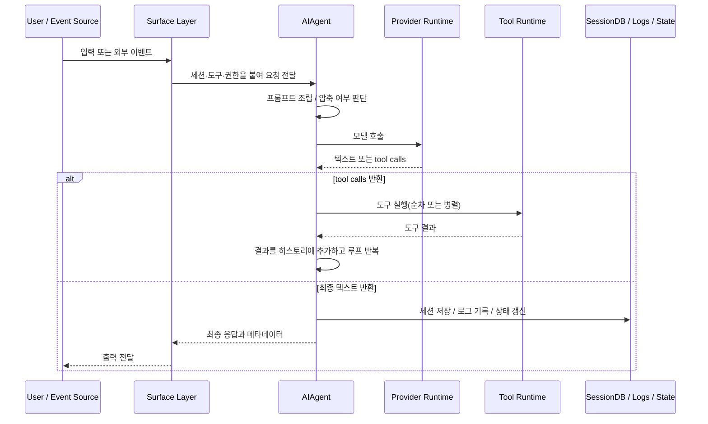

# Hermes Agent 핵심 로직

이 문서는 Hermes의 중심 실행 로직을 순서대로 설명한다. 결론부터 말하면 Hermes의 핵심은 “사용자 입력을 한 번 처리하는 함수”가 아니라 “긴 세션을 유지하면서 모델 호출, 도구 실행, 재시도, 승인, 압축, 저장, 관측을 반복 운영하는 상태 기계”다. `run_agent.py`의 `AIAgent`가 그 상태 기계의 중심이고, `gateway/run.py`, `acp_adapter/*`, `cron/*`, `api_server.py`, `mcp_serve.py`는 각자 다른 표면에서 이 코어를 안전하게 돌리기 위한 브리지들이다.

이 문서를 읽을 때는 “모델 호출 → 응답 반환” 같은 얇은 흐름을 기대하면 안 된다. Hermes에서는 한 번의 입력이 프롬프트 조립, 세션 복원, 문맥 압축, 모델 호출, 병렬 도구 실행, 승인 대기, 실패 복구, 세션 저장, 메모리 flush, 로그 기록, 상태 갱신으로 이어질 수 있다. 다시 말해 Hermes의 핵심 로직은 추론보다 운영에 더 가깝다.

## 전체 상태 전이 개요

Hermes의 기본 턴 생명주기는 아래처럼 요약할 수 있다.

이 다이어그램에서 중요한 포인트는 루프다. Hermes는 도구 호출이 끝날 때마다 다시 모델을 부른다. 그래서 “한 번의 요청”은 실제로 여러 차례의 모델-도구 왕복으로 구성된다.

## 1. 턴 준비: 세션과 런타임을 먼저 고정한다

`AIAgent`의 턴은 모델 호출보다 먼저 런타임 계약을 확정하는 단계에서 시작된다. 초기화 시점에 이미 다음 정보가 상당 부분 결정된다.

- 어떤 `provider`와 `api_mode`를 쓸지
- 어떤 도구 묶음이 활성화되는지
- 세션 ID와 상위 세션 계보가 무엇인지
- 스트리밍, 진행률, 승인 요청을 어떤 콜백으로 전달할지
- `fallback provider(대체 제공자)` 체인을 어떻게 둘지

이 준비 단계가 중요한 이유는 Hermes가 단순히 메시지를 모델에 넘기는 구조가 아니기 때문이다. 실제로는 “현재 이 세션이 어떤 권한, 어떤 저장소, 어떤 제공자 체계 아래에서 동작하는가”가 먼저 정리되어야 한다.

## 2. 프롬프트 조립: 고정층과 가변층을 분리한다

`agent/prompt_builder.py`는 Hermes의 가장 의도적인 계층 중 하나다. 핵심은 시스템 지시를 단일 문자열로 다루지 않고 몇 개의 층으로 나눈다는 점이다.

### 고정층

- 에이전트 정체성과 기본 행동 규율
- 프로필 단위의 장기 기억과 사용자 정보
- 스킬 색인과 사용 가능한 절차 요약
- 작업 공간의 지침 파일과 환경 힌트

### 가변층

- 현재 턴의 일시적 경고
- 게이트웨이 또는 플랫폼별 덧붙는 지시
- 압축 직후의 보조 지시
- 실행 표면에 따라 달라지는 임시 시스템 메시지

이 분리가 중요한 이유는 `prompt caching(프롬프트 캐싱)`과 장기 세션 비용 때문이다. 매 턴마다 접두부를 크게 바꾸면 캐시 효과가 사라지고 비용과 지연이 커진다. Hermes는 그래서 비교적 안정적인 정체성·기억 층과 자주 바뀌는 덧붙는 지시 층을 분리한다.

또 하나 중요한 점은 보안이다. `prompt_builder.py`는 작업 공간 지침과 문맥 파일을 읽을 때 숨은 유니코드, 역할 오버라이드, 명령 삽입 패턴을 스캔한다. 즉 프롬프트 조립은 단순 문자열 합치기가 아니라 첫 번째 보안 관문이다.

## 3. 문맥 압축 판단: 긴 세션을 오래 살리기 위한 운영 로직

Hermes는 긴 세션을 예외가 아니라 정상 상태로 본다. 그래서 압축도 부가 기능이 아니라 기본 인프라다.

### 코어 압축

`agent/context_compressor.py`는 대체로 다음 흐름으로 동작한다.

1. 오래된 큰 `tool result(도구 결과)`를 먼저 요약 후보로 잡는다.
2. 세션 앞쪽과 뒤쪽의 보호 구간을 계산한다.
3. 가운데 메시지 구간을 구조화 요약으로 압축한다.
4. 새 요약과 보호 구간을 합쳐 새 히스토리를 만든다.

여기서 중요한 것은 요약 형식이다. Hermes는 단순 축약보다 목표, 제약, 진행 상태, 결정, 남은 작업을 보존하려 한다. 압축 후에도 작업 연속성을 유지하려는 설계다.

### 게이트웨이 정리용 압축

`gateway/run.py`에는 별도의 자동 압축 로직이 있다. 이는 코어 압축보다 운영 위생에 가깝다. 장기 메시징 세션이 갑자기 토큰 한도에 걸리기 전에 안전판처럼 작동한다.

비전문가 관점에서 쉽게 말하면 Hermes는 예전 대화를 통째로 버리지 않고, 오래된 부분은 구조화해서 남기고 최근 부분은 그대로 살리는 방식으로 장기 대화를 유지한다.

## 4. 모델 호출: 여러 API 모드를 공통 루프로 흡수한다

Hermes의 모델 호출은 단일 SDK 래퍼가 아니다. 런타임 해석기와 `AIAgent`는 서로 다른 API 계열을 하나의 턴 루프로 맞춘다.

- `chat_completions`
- `codex_responses`
- `anthropic_messages`

이 차이는 단순 URL 차이가 아니라 메시지 구조, 추론 블록, 스트리밍 이벤트, 도구 호출 형식이 모두 다름을 뜻한다. Hermes는 내부적으로 이를 다시 공통 메시지 표현으로 맞춘다. 덕분에 코어 루프는 일관되지만, 변환 계층은 두꺼워진다.

또한 모델 이름, 베이스 URL, 자격증명 상태에 따라 어떤 실행 모드를 써야 하는지 자동으로 판단한다. 모델 공급자가 바뀌어도 상위 루프가 크게 흔들리지 않게 하려는 의도다.

## 5. 응답 검증과 재시도: 모델 오류를 정상 상태로 본다

Hermes는 이상적인 모델 응답을 전제하지 않는다. 코드가 다루는 실패 유형만 봐도 이 태도가 분명하다.

- 빈 응답
- 끊긴 스트림
- 잘못된 `tool call`
- 인증 실패
- 공급자 측 429, 5xx
- 문맥 초과
- 추론 블록만 있고 실제 응답이 없는 경우

이런 실패는 `run_agent.py` 내부에서 여러 번 복구를 시도한 뒤, 필요하면 `_try_activate_fallback()`으로 대체 제공자를 활성화한다. 즉 실패는 예외적 사고가 아니라 코어 루프가 정상적으로 감당해야 하는 상태다.

## 6. 도구 호출 경로: 병렬 가능성과 상호작용 가능성을 구분한다

모델이 도구 호출을 반환하면 Hermes는 이를 그대로 즉시 실행하지 않는다. 먼저 성격을 분류한다.

### 순차 경로

`_execute_tool_calls_sequential()`은 상호작용적이거나 세션 상태와 강하게 연결된 도구에 쓰인다.

- `clarify(명확화 질문)`
- 일부 `memory` 관련 호출
- 세션 구조를 직접 바꾸는 도구

### 병렬 경로

`_execute_tool_calls_concurrent()`는 독립성이 높고 충돌 위험이 낮은 작업에만 제한적으로 허용된다. 읽기성 파일 작업이나 웹 조회가 여기에 가깝다.

이 분리가 중요한 이유는 Hermes가 무작정 병렬화를 하지 않는다는 점이다. 모델이 여러 도구를 한꺼번에 제안해도, 상태 충돌 가능성이 있으면 직렬화한다.

### 코어가 직접 특별 취급하는 도구

일부 도구는 레지스트리를 통과해도 실제 처리 의미는 `AIAgent` 안쪽에 있다.

- `todo`
- `memory`
- `session_search`
- `delegate_task`

이들은 단순 외부 함수가 아니라 세션 구조와 깊게 연결된 로직이기 때문이다.

## 7. 도구 실행 전 안전 가드: 승인, 경로, 환경을 먼저 본다

Hermes에서 도구 실행은 함수 호출 이전에 여러 가드를 통과한다.

### 위험 명령 승인

`tools/approval.py`는 삭제, 포맷, 시스템 설정 변경, 강제 종료, 원격 스크립트 실행, 히스토리 파괴형 git 명령 같은 패턴을 감지한다. CLI에서는 동기 프롬프트, 게이트웨이에서는 세션별 승인 큐로 동작한다.

### 경로 보안

`tools/path_security.py`와 터미널/파일 도구의 작업 디렉터리 검증은 경로 이탈과 민감 경로 덮어쓰기를 막는다.

### 실행 환경 선택

`tools/terminal_tool.py`는 local, Docker, SSH, Modal, Daytona, Singularity 백엔드 중 하나를 선택하고, 필요하면 per-profile HOME과 환경 변수 override를 주입한다.

### 외부 서버 안전장치

`tools/mcp_tool.py`는 외부 `MCP` 하위 프로세스에 전달할 환경 변수를 제한하고, 오류 메시지의 비밀값을 마스킹하며, 도구 설명 자체도 스캔한다.

즉 Hermes의 도구 실행은 “모델이 불렀으니 실행한다”가 아니라 “모델이 제안했고, 로컬 정책이 허용했을 때만 실행한다”는 흐름이다.

## 8. 도구 결과를 다시 히스토리에 넣는 방식이 왜 중요한가

Hermes는 도구 결과를 대화 외부에서만 처리하지 않고, 다시 모델 입력 히스토리에 넣는다. 이때 메시지 역할 순서를 엄격히 지킨다.

- `assistant(도구 호출 포함)`
- `tool(결과)`
- 필요하면 다시 `assistant`

이 패턴은 제공자 API마다 메시지 교대 규칙이 다르기 때문에 중요하다. 도구 실행은 단순 함수 호출이 아니라, 대화 프로토콜을 보존한 채 모델과 외부 세계를 왕복시키는 과정이다.

## 9. 세션 저장과 관측: 한 턴이 끝나도 일이 끝나지 않는다

최종 응답이 나왔을 때 Hermes는 텍스트 하나만 반환하지 않는다.

### 정규 저장

`_persist_session()`과 `SessionDB`는 메시지, 토큰, 비용, 제목, 계보, 이유 토큰, 추론 메타데이터를 함께 기록한다.

### 기억 동기화

필요하면 장기 기억을 flush하거나 다음 턴을 위한 prefetch를 수행한다.

### 로그 기록

`hermes_logging.py`는 세션 태그를 붙여 `agent.log`, `errors.log`, `gateway.log`를 남긴다. 운영자는 `hermes logs`나 대시보드 API로 이를 읽는다.

### 런타임 상태 갱신

게이트웨이 상태, 활성 세션 수, 프로세스 상태는 별도 상태 계층으로 갱신되어 대시보드와 외부 상태 조회에 쓰인다.

즉 Hermes에서 “한 턴이 끝난다”는 것은 문자열 반환이 아니라 저장, 로그, 상태 갱신까지 끝난다는 뜻이다.

## 10. 메시징 게이트웨이 로직: 별도의 제어 시스템이 하나 더 있다

`gateway/run.py`는 단순 입력 라우터가 아니다. 사실상 독립적인 `control subsystem(별도 제어 계층)`이다.

### 왜 별도 제어 계층이 필요한가

메시징 환경에서는 같은 세션으로 새 메시지가 들어올 수 있고, 사용자는 실행 중인 에이전트를 멈추거나 승인하거나 큐에 넣을 수 있어야 한다. CLI보다 훨씬 많은 제어 문제가 생긴다.

### 핵심 경로

`_handle_message()`는 대체로 다음 순서로 동작한다.

1. 세션 키 계산
2. 사용자 허가 여부 확인
3. 활성 세션 존재 여부 확인
4. `/approve`, `/deny`, `/stop`, `/queue`, `/status` 같은 제어 명령 선처리
5. 일반 메시지를 `AIAgent` 경로로 전달

### 두 단계 가드

게이트웨이는 어댑터 층과 러너 층 양쪽에 가드를 둔다. 승인 메시지나 중단 명령은 에이전트가 바쁘더라도 즉시 먹어야 하기 때문이다.

## 11. 스트리밍 브리지: 표면별로 가능한 만큼만 노출한다

Hermes는 토큰 스트리밍과 도구 진행률 표시를 코어에 깊게 통합하지만, 표면마다 노출 방식은 다르다.

- CLI: 터미널에 바로 델타를 그린다.
- 게이트웨이: 메시지 편집 가능 여부를 보고 스트리밍을 켜거나 끈다.
- `ACP`: 비동기 세션 업데이트 이벤트로 변환한다.
- API 서버: `SSE(서버 전송 이벤트)` 또는 응답 체인으로 노출한다.

즉 스트리밍은 코어에서 끝나는 기능이 아니라, 각 표면의 물리 조건에 맞게 다시 포장되는 기능이다.

## 12. `cron(크론)` 로직: 세션 없는 자동화를 세션형 코어 위에 얹는다

`cron/scheduler.py`와 `cron/jobs.py`는 별도 제품처럼 보일 수 있지만, 실제로는 코어 루프를 재사용한다.

### 핵심 아이디어

- due 작업을 찾는다.
- 작업마다 새 `AIAgent` 세션을 만든다.
- 필요하면 스킬과 전달 타깃을 주입한다.
- 결과를 파일이나 메시징 플랫폼으로 보낸다.

이 설계 덕분에 자동화도 대화형 세션과 같은 능력을 쓸 수 있다. 대신 세션 히스토리를 공유하지 않기 때문에 작업 프롬프트가 스스로 충분히 설명적이어야 한다.

### 재귀 방지

크론 세션에서 스케줄 조작 도구를 제한하는 것도 중요하다. 자동화가 자기 자신을 무한히 복제하지 못하게 하기 위해서다.

## 13. `ACP` 로직: 동기 코어를 편집기 세션으로 감싼다

`acp_adapter/session.py`와 `acp_adapter/server.py`는 Hermes 세션을 편집기 세션으로 재포장한다.

### 세션 관리

편집기 세션은 메모리에만 두지 않고 세션 DB에 저장해 재개 가능하게 만든다.

### 작업 디렉터리 바인딩

편집기 `cwd(작업 디렉터리)`를 세션과 묶어, 파일/터미널 도구가 해당 워크스페이스 기준으로 동작하게 한다.

### 스레드 브리지

`AIAgent`는 작업자 스레드에서 돌고, 이벤트는 `asyncio.run_coroutine_threadsafe()`로 메인 루프에 전달된다. 편집기 쪽이 기대하는 세션 업데이트 흐름을 Hermes의 동기 코어에 맞추기 위한 타협이다.

## 14. API 서버 로직: HTTP도 결국 세션형 코어의 또 다른 표면이다

`gateway/platforms/api_server.py`는 HTTP도 세션형 에이전트 표면으로 취급한다.

- 인증은 선택적 Bearer 키로 처리한다.
- 세션 DB를 공유해 CLI·게이트웨이와 같은 세션 기록 체계를 쓴다.
- `previous_response_id` 체인을 사용해 이전 턴과 연결한다.
- CORS와 바인드 정책으로 노출 범위를 제한한다.

즉 API 서버는 겉만 맞춘 호환 계층 이상이다. HTTP 클라이언트도 장기 세션 코어에 참여하게 만든다.

## 15. 웹 대시보드 로직: 운영 인터페이스는 대화 인터페이스와 분리한다

`hermes_cli/web_server.py`와 `web/src/*`는 별도의 운영 인터페이스를 만든다.

- 공개 가능한 상태 조회와 민감한 설정 변경 API를 분리한다.
- 민감 API는 부팅 시 생성되는 세션 토큰을 요구한다.
- CORS는 기본적으로 localhost 계열만 허용한다.
- 프런트엔드는 세션, 로그, 분석, `cron`, 스킬, 환경 변수, 설정을 같은 UI에서 본다.

이는 중요한 설계 선택이다. Hermes는 “대화하는 에이전트”와 “운영하는 콘솔”을 분리해 사고한다. 장기 운영 중심 시스템에서 이 분리는 점점 중요해진다.

## 16. `MCP server` 로직: Hermes 자신을 외부 도구 생태계에 다시 노출한다

`mcp_serve.py`는 반대로 Hermes 내부 세션과 상태를 외부 `MCP client`가 소비할 수 있는 도구 집합으로 재노출한다. 흥미로운 점은 Hermes가 “도구를 소비하는 주체”이면서 동시에 “도구를 제공하는 주체”가 된다는 것이다.

`EventBridge(이벤트 브리지)`가 세션 DB와 세션 인덱스를 읽어 새 메시지와 승인 상태를 큐로 만드는 구조도 의미가 있다. 완전한 푸시 기반보다는 저장소 기반 폴링 브리지에 가깝고, 구현은 단순하지만 지연과 폴링 비용을 감수하는 선택이다.

## 17. 오류 처리와 복구 전략

Hermes의 오류 처리 전략은 “실패를 감춘다”가 아니라 “가능한 한 루프 안에서 복구하고, 안 되면 구조화된 실패를 돌려준다”에 가깝다.

### 도구 실패

레지스트리와 상위 디스패치 계층이 예외를 JSON 오류로 감싸 모델에게 되돌린다. 모델은 실패를 다시 보고 다른 전략을 선택할 수 있다.

### 모델 실패

재시도, API 모드 조정, 대체 제공자 활성화, 인증 갱신, 오류 메시지 분류가 준비되어 있다.

### 상태 저장 실패

SQLite는 WAL, 짧은 타임아웃, 애플리케이션 레벨 재시도로 쓰기 경합을 완화한다.

### 장기 세션 실패

압축, 세션 위생 자동 압축, 계보 보존, 세션 검색이 대응책이다.

즉 Hermes는 실패를 애플리케이션 외부로 밀어내기보다 내부 오케스트레이션의 일부로 흡수한다.

## 18. 병렬성 가정과 한계

Hermes는 병렬성을 쓰지만 제한적이다.

- 다중 도구 실행: 스레드 풀 기반, 안전한 경우만
- 하위 에이전트 위임: 최대 동시 수 제한
- 게이트웨이: 비동기 이벤트 + 동기 코어 스레드 실행
- `MCP`: 전용 이벤트 루프 스레드
- SQLite: 다중 리더 + 제한적 쓰기 경합 완화

이 구조는 개인 또는 소규모 운영 환경에는 잘 맞지만, 고밀도 분산 오케스트레이션 플랫폼과는 거리가 있다.

## 19. 중심 모듈과 보조 모듈

### 중심 모듈

- `run_agent.py`
- `gateway/run.py`
- `hermes_state.py`
- `tools/registry.py`
- `hermes_cli/runtime_provider.py`
- `agent/prompt_builder.py`
- `hermes_logging.py`

이 모듈들이 바뀌면 거의 모든 표면이 영향을 받는다.

### 보조 모듈

- 개별 플랫폼 어댑터
- 대시보드 프런트엔드
- 개별 기억 플러그인
- 일부 연구·배치 실행 경로
- 설치·패키징 보조 스크립트

보조 모듈도 중요하지만, 제품의 정체성과 운영상의 핵심 동작은 중심 모듈 쪽에서 결정된다.

## 20. 왜 이 로직이 재구현에 어려운가

Hermes를 비슷하게 다시 만들 때 어려운 부분은 모델 호출 자체가 아니다. 더 어려운 것은 다음이다.

- 긴 세션에서 상태를 잃지 않는 법
- 서로 다른 제공자 응답 형식을 하나의 루프로 맞추는 법
- 승인·격리·경로 보안을 도구 실행 전에 자연스럽게 끼워 넣는 법
- 메시징 게이트웨이의 인터럽트와 승인 우회 흐름
- 압축 후에도 작업 맥락을 유지하는 요약 형식
- 인터페이스가 늘어나도 코어 동작 의미를 유지하는 법
- 로그, 상태 API, 대시보드를 코어와 어긋나지 않게 붙이는 법

즉 핵심 로직의 복잡성은 모델보다 오케스트레이션에 있다.

## 요약

Hermes의 핵심 로직은 “턴 준비 → 프롬프트 조립 → 압축 판단 → 모델 호출 → 도구 실행 → 승인과 복구 → 세션 저장 → 로그와 상태 갱신”으로 이어지는 상태 기계다. 메시징 게이트웨이는 여기에 인터럽트와 승인 제어를 얹고, `cron`은 비대화형 자동화를, `ACP`는 편집기용 이벤트 브리지를, API 서버와 대시보드는 운영 인터페이스를, `MCP server`는 외부 상호운용 인터페이스를 더한다. Hermes가 어려운 이유도, 그리고 복제 가치가 있는 이유도 바로 이 복합 오케스트레이션에 있다.
