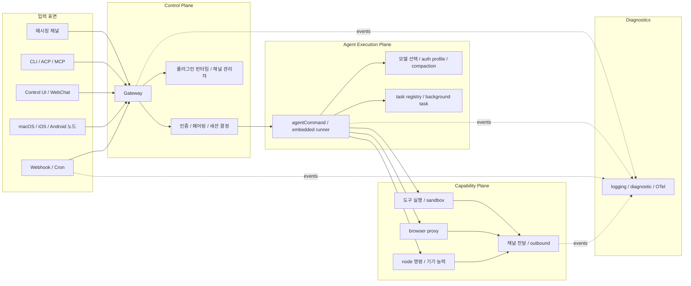
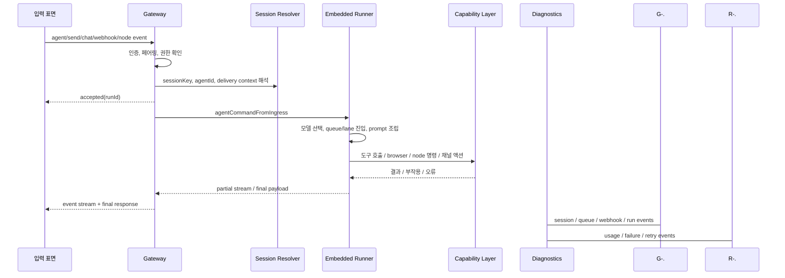

# OpenClaw 시스템 설계

이 문서는 OpenClaw의 런타임이 어떤 구성요소와 경계로 조직되는지 설명한다. 핵심 판단부터 말하면 OpenClaw의 시스템 설계는 “여러 입력 표면이 하나의 `Gateway(게이트웨이)`로 수렴하고, 그 게이트웨이가 세션·인증·에이전트 실행·기기 능력·도구 부작용·결과 전달을 조정하는 구조”다.

## 먼저 봐야 할 구조적 결론

OpenClaw의 런타임은 보기보다 단순한 원리 위에 서 있다. 메시징 채널, `CLI(명령행 인터페이스)`, 웹 제어 UI, macOS/iOS/Android `node(노드)`, webhook, cron, ACP/MCP 연결이 모두 게이트웨이로 들어오고, 게이트웨이는 이를 적절한 세션과 실행 문맥으로 바꾼 뒤 `agent execution(에이전트 실행)` 경로나 기기 명령, 채널 전달, 백그라운드 태스크 경로로 보낸다.

코드상으로는 `src/gateway/server.impl.ts`가 중심이고, `src/gateway/server-methods/agent.ts`, `src/gateway/auth.ts`, `src/agents/agent-command.ts`, `src/agents/pi-embedded-runner/run.ts`가 실행 평면을 만든다. 여기에 `src/cron/service.ts`, `src/acp/server.ts`, `src/mcp/channel-server.ts`, `src/logging/diagnostic.ts`, `extensions/browser`, `extensions/webhooks`, `extensions/diagnostics-otel`이 덧붙는다. 따라서 OpenClaw를 이해할 때는 “웹 서버 하나 + 모델 호출 하나”보다 “중앙 허브 + 세션화된 실행 경로 + 분산된 능력 호스트 + 진단 계층”이라는 관점이 필요하다.

## 런타임은 세 개의 평면으로 나눠 보면 이해하기 쉽다

OpenClaw의 시스템 설계는 `control plane(제어 평면)`, `agent execution plane(에이전트 실행 평면)`, `capability plane(기능 실행 평면)`으로 나눠 보면 훨씬 이해하기 쉽다. 여기에 `observability(관측성)`와 `diagnostics(진단)`는 별도 실행 평면이라기보다, 각 계층의 상태를 기록하고 내보내는 공통 계층에 가깝다.

### `control plane(제어 평면)`

`control plane(제어 평면)`의 중심은 `Gateway(게이트웨이)`다. `src/gateway/server.impl.ts`는 인증, `WebSocket(웹소켓)` 연결, HTTP 표면, 웹 제어 UI, 채널 관리자, 플러그인 런타임, 상태 점검, 스케줄 서비스, 노드 세션 런타임, 훅, 보조 서비스 초기화를 함께 다룬다. 이 계층의 역할은 “무엇이 들어왔는지”를 이해하고 “어느 세션과 권한으로 처리할지”를 결정하는 것이다.

### `agent execution plane(에이전트 실행 평면)`

실제 `agent loop(에이전트 루프)`는 게이트웨이와 분리된 하위 실행 평면으로 볼 수 있다. `src/gateway/server-methods/agent.ts`가 요청을 수락한 뒤 `src/agents/agent-command.ts`와 `src/agents/pi-embedded-runner/run.ts`가 세션 해석, 모델 선택, `auth profile(인증 프로필)`, 컨텍스트 관리, 재시도, `failover(장애 전환)`, `compaction(압축 요약)`, 스트리밍 조립을 수행한다. 이 계층은 “무엇을 해야 하는가”를 실제 실행으로 바꾸는 곳이다.

### `capability plane(기능 실행 평면)`

도구, 브라우저, 메시지 전송, `node command(노드 명령)`, 캔버스, 카메라, 위치, 음성, 자동화, 웹훅, 백그라운드 태스크는 `capability plane(기능 실행 평면)`에 속한다. OpenClaw는 이 층을 코어 한가운데 박아 두지 않고 `src/plugins/runtime/**`, `extensions/*`, `src/node-host/**`, `src/agents/tools/**`, `src/infra/outbound/**`를 통해 분산된 능력 계층으로 조직한다.

### `observability(관측성)` / `diagnostics(진단)`

`src/logging/diagnostic.ts`, `src/logging/**`, `extensions/diagnostics-otel/src/service.ts`를 보면 OpenClaw는 실행·전달·웹훅·세션 상태를 관측 가능한 이벤트 흐름으로 본다. 이 계층은 별도 평면이라기보다, 각 런타임 경계의 상태 변화를 중앙에서 읽고 내보내는 횡단 구조다.

## 전체 구조는 강한 중앙 허브형에 가깝다

OpenClaw의 런타임 토폴로지는 분산 시스템처럼 보이지만, 현재 구현 기준으로는 강한 중앙 허브형 구조다. 아래 다이어그램은 그 핵심 경로를 단순화한 것이다.

이 구조의 장점은 일관성이다. 세션, 권한, 이벤트, 채널 연결, 모델 선택, 승인 절차가 한곳에서 합쳐지므로 사용자는 어느 표면에서 진입하든 비슷한 동작을 기대할 수 있다. 반대로 비용도 분명하다. 게이트웨이의 책임이 커지고, `docker-compose.yml`, `render.yaml`, `scripts/k8s/manifests/**`가 모두 상태성 있는 단일 허브를 전제하게 된다.

## 입력 지점은 많지만, 모두 같은 게이트웨이로 모인다

### `CLI(명령행 인터페이스)`

CLI는 단순 로컬 디버그 도구가 아니다. `openclaw.mjs`, `src/entry.ts`, `src/cli/run-main.ts`는 런타임 검사, 프로파일 적용, 컨테이너 라우팅, 플러그인 명령 등록, 전역 오류 처리까지 수행한다. `src/commands/agent-via-gateway.ts`는 가능하면 같은 게이트웨이 메서드를 원격 호출한다. 즉 CLI는 로컬 진입점이면서 동시에 게이트웨이 클라이언트다.

### Web UI와 WebChat

웹 제어 UI와 WebChat은 별도 백엔드가 아니라 게이트웨이에 붙은 표면이다. `ui/`는 `Lit(릿)`와 `Vite(바이트)` 기반의 비교적 가벼운 프런트엔드를 제공하고, `src/gateway/server.impl.ts`는 이를 같은 프로세스 안에서 서빙한다. 이는 UI가 독립 `application tier(애플리케이션 계층)`가 아니라 제어 평면의 일부라는 뜻이다.

### 메시징 채널

WhatsApp, Telegram, Slack, Discord, Matrix, Google Chat 등은 저장소 차원에서는 개별 채널처럼 보이지만, 시스템 설계상으로는 얇은 `adapter(어댑터)`에 가깝다. 실제 핵심은 채널별 수신 이벤트를 공통 세션 모델과 전달 모델로 정규화하는 것이다. `src/channels/**`, `extensions/*`, `src/infra/outbound/**` 조합이 이 역할을 맡는다.

### macOS, iOS, Android `node(노드)`

모바일과 데스크톱 앱은 “또 다른 채팅 클라이언트”라기보다 능력 호스트다. `apps/*`, `src/node-host/**`, `src/gateway/server-node-session-runtime.ts`, `extensions/device-pair`를 보면 카메라, 화면, 위치, 푸시, 음성, 캔버스 같은 권한을 게이트웨이에 노출하고, 서버가 그 주장값을 다시 정책적으로 검증한다. 즉 UI보다 능력 제공 경계가 더 중요하다.

### webhook과 cron

자동화 입력도 같은 구조 안에 편입된다. `src/cron/service.ts`, `src/cron/isolated-agent/run.ts`, `extensions/webhooks/src/http.ts`, `src/gateway/server-cron.ts`를 함께 보면 cron과 webhook은 별도 제품이 아니라 게이트웨이가 받아들이는 또 하나의 `ingress(유입 표면)`다. 이는 사람 메시지와 자동화 트리거가 결국 같은 세션·실행 파이프라인으로 흘러간다는 뜻이다.

### ACP/MCP 브리지

`src/acp/server.ts`와 `src/mcp/channel-server.ts`는 OpenClaw가 자기 프로토콜만 쓰지 않는다는 점을 보여 준다. ACP 쪽은 외부 `agent protocol(에이전트 프로토콜)` 세션을 게이트웨이에 연결하고, MCP 쪽은 채널·도구를 외부 툴링에 노출한다. 이 표면들은 단순 부가 기능이 아니라, OpenClaw의 세션·승인·전달 모델을 다른 에이전트 생태계와 접속시키는 브리지다.

## 외부 인터페이스는 많지만, 경계 설정은 비교적 일관적이다

OpenClaw는 외부와 접하는 면이 많다. 그러나 실제로는 몇 가지 인터페이스 패턴으로 수렴한다.

- `WebSocket(웹소켓)` 제어 프로토콜: 운영자 클라이언트와 노드가 게이트웨이에 붙는 기본 경로
- HTTP 표면: `healthz`, `readyz`, 제어 UI, 일부 호환 API, 웹훅 엔드포인트
- 메시징 채널 SDK: Telegram, WhatsApp, Slack, Discord 등 외부 메신저 연결
- 로컬/원격 장치 인터페이스: 카메라, 위치, 푸시, 화면, 오디오 등 모바일·데스크톱 능력 노출
- 제공자 API: 모델, 음성, 미디어 이해, 웹 검색, 이미지·비디오 생성 같은 외부 AI 백엔드
- ACP/MCP 브리지: 외부 에이전트 툴링과의 세션·도구 연결

이렇게 보면 OpenClaw의 통합 표면은 넓지만, 경계가 제멋대로 퍼져 있지는 않다. 외부 서비스와 직접 맞닿는 코드는 플러그인과 런타임 어댑터 쪽으로 밀어내고, 게이트웨이는 “누가 무엇을 요청했고 어느 세션과 권한으로 처리할 것인가”를 조정하는 중심에 남는다.

## 요청 흐름은 “즉시 수락, 나중 완료” 패턴이다

OpenClaw에서 `agent(에이전트)` 요청은 전형적인 요청-응답 `RPC(원격 프로시저 호출)`처럼 끝나지 않는다. `src/gateway/server-methods/agent.ts`는 `runId(실행 ID)`를 발급하고 먼저 `accepted` 성격의 응답을 준 다음, 실제 작업을 비동기 경로로 분리한다. 이후 스트리밍 이벤트와 최종 결과가 순차적으로 전달된다.

이 설계는 긴 실행, 도구 호출, 중간 상태 노출, 재시도를 전제로 할 때 유리하다. 사용자는 “명령을 보냈는데 아무 응답이 없다”보다 “지금 접수되었고, 진행 상태가 보이며, 끝나면 확정 결과가 온다”는 경험을 얻게 된다.

## 모델 호출은 게이트웨이가 아니라 실행 평면에서 처리된다

OpenClaw에서 모델은 게이트웨이가 직접 부르지 않는다. 게이트웨이는 세션과 실행 문맥을 결정하고, 실제 모델 상호작용은 `src/agents/agent-command.ts`, `src/agents/pi-embedded-runner/run.ts`, `src/agents/auth-profiles/**`에서 일어난다. 이 경계 덕분에 게이트웨이는 입력·권한·라우팅 허브로 남고, 모델별 세부 차이는 실행 평면에 격리된다.

이 구조의 중요한 특징은 모델 선택이 단순 API 키 조회가 아니라는 점이다. `auth profile(인증 프로필)` 회전, 실패 기록, 쿨다운, 모델 `fallback(대체 경로)`, 제공자별 파라미터 차이가 함께 다뤄진다. 저장소 구성만 보면 OpenClaw는 “한 모델 제공자에 최적화된 제품”보다 “모델 변경과 실패를 운영 가능한 방식으로 흡수하는 제품”에 더 가깝다.

## 도구 실행 경로는 조정 로직과 실제 부작용을 분리해 둔다

OpenClaw는 모델이 직접 시스템을 만지게 두지 않는다. 모델은 `tool calling(도구 호출)`으로 의도를 표현하고, 실제 실행은 `tool policy(도구 정책)`, 샌드박스, 노드 정책, 채널 액션 어댑터가 통과한 뒤 이뤄진다. `src/agents/tool-policy-pipeline.ts`, `src/agents/sandbox/**`, `src/node-host/exec-policy.ts`, `src/plugins/runtime/**`, `extensions/browser/src/browser-tool.ts`가 이 경계를 구성한다.

이 설계는 두 가지 효과를 낸다. 첫째, 모델 교체와 도구 실행이 분리되므로 특정 제공자에 덜 종속된다. 둘째, 실행 권한을 “모델이 요청했는가”가 아니라 “현재 세션·정책·장치·운영자 범위에서 허용되는가”로 판단할 수 있다. OpenClaw가 강한 실행 능력을 가져가면서도 보안 가드레일을 포기하지 않는 이유가 바로 이 분리다.

## 상태는 세션에 모이고, 제어는 큐를 따라 흐른다

OpenClaw의 상태 흐름은 `session(세션)` 중심이다. `sessionKey(세션 키)`, `sessionId(세션 ID)`, `agentId(에이전트 ID)`, 채널 대상, 하위 에이전트 관계, 모델 override, 사용량, 전달 문맥이 모두 세션에 붙는다. `src/config/sessions/**`, `src/sessions/**`, `src/agents/command/session.ts`, `src/gateway/session-utils.ts`가 그 저장과 해석을 담당한다.

반면 제어 흐름은 큐 중심이다. `src/process/command-queue.ts`는 같은 세션의 실행 충돌을 막고, `src/agents/pi-embedded-runner/run.ts`는 `session lane(세션 레인)`과 `global lane(전역 레인)`을 함께 사용한다. 여기에 `src/tasks/task-registry.maintenance.ts`는 장기 작업과 백그라운드 태스크의 생명주기를 별도 레지스트리로 유지한다.

이 차이를 이해하는 것이 중요하다. OpenClaw는 단순 메시지 큐 제품이 아니고, 단순 상태 저장소 제품도 아니다. 세션이 무엇을 보존할지와 큐가 무엇을 직렬화할지를 동시에 설계해야 이 구조가 성립한다.

## 신뢰 경계는 입력 표면보다 더 촘촘하게 나뉜다

### 외부 입력은 기본적으로 비신뢰다

코드상으로는 채널에서 들어오는 메시지를 기본적으로 신뢰하지 않는다. `src/gateway/auth.ts`, `src/channels/**`, `src/pairing/**`를 보면 Telegram, WhatsApp, Signal, Slack, Discord 등은 `pairing(페어링)`, allowlist, 명시적 opt-in 같은 절차를 거친다.

### 접속 자체도 별도 신뢰 수립 절차를 거친다

게이트웨이 접속은 일반 메서드 호출과 분리된 연결 수립 절차를 가진다. `src/gateway/server-ws-runtime.ts`, `src/gateway/auth.ts`, 프로토콜 스키마를 보면 연결 수립 단계에서 역할, 범위, 자격 증명이 먼저 정리된다. 이는 “연결을 맺는 것” 자체를 비즈니스 메서드와 다른 신뢰 경계로 본다는 뜻이다.

### `node(노드)`의 능력 선언은 주장일 뿐이다

노드가 `caps`, `commands`, `permissions`를 선언하더라도 최종 강제는 서버가 한다. `src/gateway/server-methods/nodes.ts`, `src/node-host/exec-policy.ts`, `src/agents/tool-policy-pipeline.ts`, `src/agents/sandbox/**`가 교차 검증 경로를 가진다. 장치가 “카메라를 쓸 수 있다”고 주장해도, 세션과 정책이 허용하지 않으면 실행되지 않는다.

### 비신뢰 입력 표면은 채널보다 더 넓다

실무적으로 보면 비신뢰 입력은 DM만이 아니다. 웹훅 본문, 채널 첨부 파일, 브라우저 업로드, 노드가 주장하는 capability, 플러그인 경로, 프록시 헤더, 외부 브리지 프로토콜도 모두 검증 대상이다. OpenClaw가 각 경계에 서로 다른 검증기를 둔 이유는 입력 표면의 위험 모델이 서로 다르기 때문이다.

## 관측성과 병목도 런타임 설계의 일부다

OpenClaw는 진단 계층을 나중에 덧댄 흔적보다 처음부터 운영 시스템으로 설계한 흔적이 더 강하다. `src/logging/diagnostic.ts`는 웹훅 수신, 메시지 큐잉, 세션 상태 전이, 처리 시간, 레인 깊이 같은 이벤트를 구조화해 남기고, `extensions/diagnostics-otel/src/service.ts`는 이를 `OpenTelemetry(오픈텔레메트리)` 트레이스·메트릭·로그로 내보낸다.

이 구조가 보여 주는 병목도 분명하다.

- 세션 레인 직렬화는 정합성을 주지만 같은 세션의 병렬성을 희생한다.
- 상태성 있는 단일 허브는 일관성을 주지만 장애 반경을 넓힌다.
- 플러그인 부트스트랩과 런타임 결합은 확장성을 주지만 시작 비용과 실패 표면을 늘린다.
- 승인 왕복과 샌드박스 정책은 안전성을 주지만 인터랙션 지연을 만든다.

즉 관측성과 병목은 부차적인 운영 문제가 아니라, OpenClaw의 시스템 설계를 이해할 때 같이 봐야 하는 핵심 속성이다.

## 배포 형태는 상태성 있는 단일 허브를 전제한다

`docker-compose.yml`, `render.yaml`, `scripts/k8s/manifests/deployment.yaml`은 모두 OpenClaw를 장기 실행 서비스로 취급하지만, 그 방식은 `stateless(무상태)` 웹 서버와 다르다. 설정과 작업 공간을 볼륨으로 붙이고, 영속 디스크를 사용하며, `Kubernetes(쿠버네티스)` 배포도 `replicas: 1`과 `Recreate` 전략을 택한다.

이 선택은 두 가지를 보여 준다. 첫째, OpenClaw는 세션과 채널 연결 상태를 가진 강한 상태성 시스템이다. 둘째, 보안 기본값은 비교적 공격적으로 잡혀 있다. 읽기 전용 루트 파일 시스템, 비특권 컨테이너, 권한 축소 설정은 “단일 허브이지만 함부로 넓게 열지 않겠다”는 운영 태도를 반영한다.

## 정리

OpenClaw의 시스템 설계는 복잡한 기능 목록보다 “중앙 `Gateway(게이트웨이)`가 모든 표면을 받아 세션과 실행 경로를 정규화한다”는 한 문장으로 요약하는 편이 정확하다. 그 위에서 `agent execution plane(에이전트 실행 평면)`이 모델·컨텍스트·재시도를 처리하고, `capability plane(기능 실행 평면)`이 실제 부작용을 수행하며, `diagnostics(진단)` 계층이 그 전체를 관측한다.

이 구조는 멀티채널 개인 허브와 실행형 에이전트 런타임을 결합하는 데 강하다. 반면 상태성, 승인 절차, 플러그인 부트스트랩, 외부 브리지 연결이 모두 같은 허브에 모이기 때문에 운영 복잡성도 커진다. OpenClaw의 런타임 설계는 그 상쇄를 숨기지 않고 구조로 관리하려는 사례로 읽는 편이 맞다.
