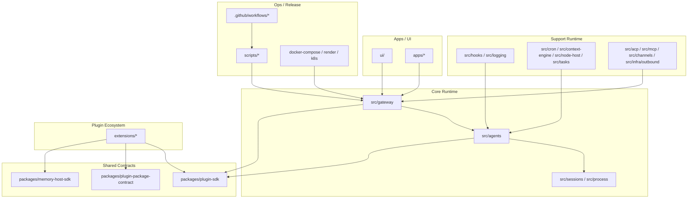
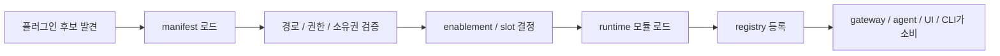

# OpenClaw 소프트웨어 아키텍처

이 문서는 OpenClaw 저장소를 아키텍처 관점에서 다시 정리한다. 결론부터 말하면 OpenClaw의 저장소 구조는 단순한 `monorepo(모노레포)` 정리가 아니라, 코어 런타임과 공식 확장 생태계, 공유 계약 패키지, 네이티브 앱, 웹 UI, 운영 스크립트를 서로 다른 유지보수 경계로 나눠 놓은 구조다.

## 먼저 봐야 할 아키텍처 결론

OpenClaw는 “거대한 단일 코드베이스”처럼 보이지만, 실제로는 큰 축이 비교적 분명하다. `src/`는 제품 중심 실행 로직, `extensions/`는 공식 확장 생태계, `packages/`는 공개 계약과 SDK, `apps/`는 네이티브 능력 호스트, `ui/`는 제어 표면, `scripts/`와 `.github/workflows/`는 빌드·검증·릴리스 가드레일을 담당한다.

이 분리는 저장소를 보기 좋게 정리하려는 수준의 문제가 아니다. `pnpm-workspace.yaml`이 루트, `ui`, `packages/*`, `extensions/*`를 한 작업 공간으로 묶는 이유는 코어와 확장을 같은 릴리스 주기 안에서 움직이게 하기 위해서고, 동시에 `packages/plugin-sdk`와 `packages/plugin-package-contract`를 별도 계층으로 둔 이유는 코어 내부 리팩터링 자유도를 지키기 위해서다.

## 저장소는 크게 일곱 계층으로 나눠 볼 수 있다

OpenClaw 저장소는 아래 일곱 층으로 설명할 수 있다.

| 계층 | 주요 경로 | 역할 | 아키텍처 해석 |
| --- | --- | --- | --- |
| `core runtime(코어 런타임)` | `src/gateway`, `src/agents`, `src/sessions`, `src/process` | 게이트웨이, 세션, 실행 루프, 큐 제어 | 제품의 본체 |
| `support runtime(보조 런타임)` | `src/hooks`, `src/logging`, `src/cron`, `src/node-host`, `src/context-engine`, `src/tasks` | 훅, 진단, 자동화, 장치 실행, 문맥 유지, 배경 작업 | 코어를 떠받치는 기반층 |
| `bridge/runtime protocol(브리지/프로토콜)` | `src/acp`, `src/mcp`, `src/channels`, `src/infra/outbound` | 외부 에이전트 툴링, 채널 전달, 프로토콜 번역 | OpenClaw를 외부 생태계와 연결하는 경계 |
| `plugin ecosystem(플러그인 생태계)` | `extensions/`, `src/plugins/` | 제공자, 채널, 메모리, 브라우저, 웹훅, 진단 등 공식 확장 | 기능 외연을 수용하는 층 |
| `shared packages/contracts(공유 계약 패키지)` | `packages/plugin-sdk`, `packages/plugin-package-contract`, `packages/memory-host-sdk` | 외부 확장과 내부 확장이 기대할 안정 표면 | 호환성 경계 |
| `apps and UI(앱과 UI)` | `apps/*`, `ui/` | 네이티브 능력 호스트와 웹 제어 표면 | 사용자 접점이지만 코어를 대체하지 않음 |
| `ops/release(운영/릴리스)` | `scripts/`, `.github/workflows/`, `docker-compose.yml`, `render.yaml` | 빌드, 검증, 패키징, 배포, 릴리스 | 복잡도를 통제하는 운영 장치 |

이 표가 중요한 이유는 패키지 경계가 곧 런타임 경계를 완벽히 복제하지는 않더라도, 유지보수 책임과 호환성 경계를 상당히 잘 반영하기 때문이다. 예를 들어 `src/gateway/**`와 `src/agents/**`는 서로 강하게 엮이지만 둘 다 코어 런타임에 속하고, `extensions/*`는 코어와 함께 배포되더라도 아키텍처상 확장 계층이다.

## 저장소 구조를 보면 코어와 확장 계층의 경계가 보인다

이 그림에서 특히 중요한 점은 `extensions/*`가 샘플이 아니라 공식 생태계라는 사실이다. OpenClaw는 기능 외연을 코어 외부 개념으로 취급하면서도, 실제 진화는 같은 저장소 안에서 함께 진행한다. 이는 생태계 유연성과 릴리스 통제력을 동시에 가져가려는 선택이다.

## `src/`는 하나가 아니라 여러 코어 계층으로 나뉜다

### `src/gateway/`는 네트워크와 제어의 중심이다

`src/gateway/`는 단순 프로토콜 핸들러가 아니다. `server.impl.ts`가 초기화 허브이고, `auth.ts`는 접속 인증과 신뢰 모델, `server-methods/*`는 공개 메서드 표면, `server/*`는 건강 상태·TLS·훅·readiness 보조 계층을 담당한다. 이 모듈군은 OpenClaw의 외부 경계와 운영 경계를 함께 소유한다.

### `src/agents/`는 에이전트 실행 엔진이다

`src/agents/`는 OpenClaw의 두 번째 중심이다. `agent-command.ts`가 상위 실행 조정자이고, `command/*`는 세션 해석과 전달, `pi-embedded-runner/*`는 실제 실행 루프, `auth-profiles/*`는 모델 인증 상태, `skills/*`는 스킬 스냅샷과 필터링, `sandbox/*`는 격리 정책을 담당한다. 현재 코드 기준으로 OpenClaw의 핵심 복잡성은 상당 부분 이 계층에 있다.

### `src/plugins/`는 확장 관리의 중심이다

`src/plugins/`는 발견, 활성화, 진단, 로딩, 레지스트리, 런타임 파사드, CLI 통합, 메모리 슬롯 관리, 상호작용 핸들러까지 포함한다. `loader.ts`는 캐시와 재진입 방지와 범위별 로드를 다루고, `registry.ts`는 제공자·채널·도구·훅·서비스를 등록하며, `runtime/index.ts`는 플러그인이 사용할 런타임 파사드를 구성한다.

### 보조로 보이는 디렉터리도 실제로는 기반층에 가깝다

다음 디렉터리들은 보조처럼 보이지만 제품적으로 중요하다.

- `src/hooks/`: 내부 훅과 플러그인 훅 결합, 훅 로더, 훅 정책
- `src/logging/`: 구조화 로그, 진단 이벤트, 세션 상태 추적, 로그 redaction
- `src/cron/`: 자동화 스케줄러, 격리 에이전트 실행, 전달 정책
- `src/node-host/`: 장치 호스트, 실행 정책, 노드 설정과 접속
- `src/context-engine/`: 긴 세션 유지와 문맥 보존
- `src/tasks/`: 백그라운드 태스크, 태스크 레지스트리, 상태 청소
- `src/acp/`, `src/mcp/`: 외부 에이전트 툴링 연결 브리지
- `src/media/`, `src/image-generation/`, `src/media-understanding/`: 멀티모달 처리 기반층

즉 `src/`는 하나의 거대한 코어가 아니라, 중앙 허브를 중심으로 서로 다른 책임이 층화된 집합이다.

## `extensions/`는 선택 기능 집합이 아니라 공식 생태계다

OpenClaw의 `extensions/*`는 데모나 샘플이 아니다. 실제 제품 외연의 많은 부분이 이 계층에 있다. 대표 사례만 봐도 구조가 분명하다.

- `extensions/browser`: 브라우저 프록시, 탭 관리, 스크린샷, 브라우저 보안 검사
- `extensions/memory-core`: 메모리 관리, 검색, 프롬프트 섹션, 장기 기억 승격
- `extensions/device-pair`: 장치 페어링과 인증
- `extensions/webhooks`: 외부 HTTP 유입과 `taskFlow(태스크 플로우)`
- `extensions/diagnostics-otel`: `OpenTelemetry(오픈텔레메트리)` 수집
- 제공자 확장: `extensions/openai`, `extensions/anthropic`, `extensions/google`, `extensions/openrouter` 등
- 채널 확장: `extensions/discord`, `extensions/telegram`, `extensions/whatsapp`, `extensions/matrix` 등

이 구조가 의미하는 바는 분명하다. OpenClaw는 코어를 작게 유지한다기보다, 코어가 “확장 기능을 수용하는 규칙”을 소유하고 개별 기능은 가능한 한 확장 계층으로 밀어낸다. 그래서 저장소는 커지지만 기능별 소유권은 상대적으로 분명해진다.

## `plugin SDK(플러그인 SDK)`가 실제 호환성 경계다

OpenClaw 아키텍처에서 가장 의도적인 경계는 `plugin SDK(플러그인 SDK)`다. 루트 `package.json`은 `openclaw/plugin-sdk/*` 서브패스를 다수 내보내고, `packages/plugin-sdk`는 플러그인이 내부 구현을 직접 참조하지 않아도 런타임 표면을 사용할 수 있게 만든다.

이 경계의 목적은 세 가지다.

- 코어 내부 리팩터링 자유도 확보
- 번들 플러그인과 외부 플러그인을 같은 계약 위에 올리기
- 정적 메타데이터 기반 진단과 로딩 계획 가능하게 만들기

함께 놓인 `packages/plugin-package-contract`는 플러그인 패키지 형식 자체를 계약화한다. 즉 OpenClaw는 “무엇을 공개 계약으로 볼 것인가”를 저장소 안에서 별도 패키지 층으로 관리한다.

## `manifest(매니페스트)`는 로딩 파이프라인의 핵심이다

`src/plugins/manifest.ts`, `src/plugins/manifest-registry.ts`, `src/plugins/discovery.ts`, `src/plugins/loader.ts`를 보면 OpenClaw의 플러그인 시스템은 코드 모듈보다 `manifest(매니페스트)`를 먼저 본다. 이는 구성 검증, 활성화 계획, 슬롯 충돌 판단, CLI 명령 노출, UI 힌트, 환경 변수 진단을 런타임 실행 없이 처리하려는 설계다.

이 과정에서 `src/plugins/discovery.ts`의 경로 탈출 검사, 전역 쓰기 가능 디렉터리 차단, 수상한 소유권 탐지 로직이 중요해진다. OpenClaw는 플러그인을 단순 “확장 기능”이 아니라 시스템에 코드를 주입하는 고위험 입력으로 본다. 그래서 발견 단계 자체가 보안 경계가 된다.

## 훅 아키텍처는 별도 서브시스템으로 봐야 한다

OpenClaw의 훅은 단순 이벤트 리스너가 아니다. `src/hooks/internal-hooks.ts`, `src/hooks/plugin-hooks.ts`, `src/hooks/loader.ts`, `src/hooks/policy.ts`를 보면 내부 훅과 플러그인 훅이 각각 별도 등록 경로와 정책을 가진다.

핵심 역할 분담은 다음과 같다.

- `src/hooks/internal-hooks.ts`: 게이트웨이, 메시지, 세션, 명령 관련 내부 훅 이벤트 정의와 등록
- `src/hooks/plugin-hooks.ts`: 활성 플러그인에서 훅 디렉터리를 수집해 런타임에 결합
- `src/hooks/loader.ts`: 작업 공간 훅, 번들 훅, 플러그인 훅의 로드와 재로드
- `src/hooks/policy.ts`: 훅 enablement(활성화)와 안전성 판단
- `src/hooks/bundled/session-memory`: `/new`, `/reset` 시 세션 요약을 메모리로 내리는 번들 훅 팩

이 구조는 중요한 설계 선택을 보여 준다. OpenClaw는 훅을 단순 “부가 자동화”가 아니라, 세션 수명주기와 메시지 처리, 메모리 동기화를 바꾸는 런타임 개입점으로 본다.

## 세션, 스킬, 프롬프트, 메모리는 흩어져 있지만 모델은 일관적이다

### 세션 모델

세션은 `src/config/sessions/**`, `src/sessions/**`, `src/gateway/session-utils.ts`, `src/agents/command/session.ts`에 걸쳐 조직된다. 저장 경로와 읽기 경로가 분리되어 있어 다소 두꺼워 보이지만, 게이트웨이·CLI·에이전트 실행 경로가 같은 세션 상태를 공유해야 하기 때문에 생긴 구조다.

### 스킬 조직

`src/agents/skills/**`는 번들 스킬, 플러그인 스킬, 작업 공간 스킬을 구분해 관리한다. 이는 `skill(스킬)`을 단순 설명 텍스트가 아니라 버전이 있고 필터링 가능하며 스냅샷을 만들 수 있는 실행 자산으로 본다는 뜻이다.

### 프롬프트 조립

`src/agents/pi-embedded-runner/system-prompt.ts`, `src/agents/system-prompt.ts`, `src/agents/skills.ts`를 보면 `system prompt(시스템 프롬프트)`는 단일 파일 하나가 아니다. 기본 지침, 스킬 프롬프트, 컨텍스트 파일, 모델별 가이드, 런타임 오버라이드가 합쳐져 최종 프롬프트가 된다. OpenClaw는 프롬프트를 정적 문서보다 런타임 조립 산출물로 본다.

### 메모리 구조

`extensions/memory-core/src/prompt-section.ts`는 메모리 도구 사용 지침을 프롬프트 일부로 주입하고, `packages/memory-host-sdk`는 메모리를 확장 가능한 호스트 계약으로 분리한다. 여기에 번들 `session-memory` 훅은 런타임 자산 파일과 세션 내용을 연결해 장기 기억으로 밀어 넣는다. 이 설계는 메모리를 단순 저장소보다 “실행 중 문맥을 확장하는 별도 서브시스템”으로 보는 관점에 가깝다.

## 브리지와 백그라운드 작업 계층 때문에 시스템 범위가 더 넓어진다

`src/acp/**`, `src/mcp/**`, `src/tasks/**`는 OpenClaw가 단순 채팅 허브를 넘어서는 이유를 잘 보여 준다.

- `src/acp/`: 외부 ACP 세션을 게이트웨이와 결합하고, 런타임 제어 옵션과 세션 재개를 관리한다.
- `src/mcp/`: 채널과 도구를 MCP 서버 표면으로 노출한다.
- `src/tasks/`: 백그라운드 태스크, 상태 유지, 정리, 전달 알림을 관리한다.

이 세 계층은 공통적으로 “포그라운드 한 턴으로 끝나지 않는 작업”을 다룬다. 즉 OpenClaw는 단순 대화형 제품보다 장기 실행과 외부 도구 생태계 결합에 더 많은 아키텍처를 투자하고 있다.

## 네이티브 앱과 웹 UI는 코어를 대체하지 않고 보완한다

OpenClaw의 `apps/*`와 `ui/`를 보면 표면이 많아 보여도, 구조적으로는 모두 코어 런타임의 위나 옆에 붙는 방식이다. `apps/macos`, `apps/ios`, `apps/android`는 각자 별도 배포 체계와 권한 모델을 가지지만, 역할은 “독립 백엔드”가 아니라 게이트웨이와 프로토콜로 연결되는 능력 호스트다.

`ui/`도 마찬가지다. `Lit(릿)` 기반 Control UI는 독립형 SaaS 프런트엔드가 아니라 게이트웨이가 직접 서빙하는 운영 표면이다. 이 구조는 UI를 가볍게 유지하는 대신 게이트웨이와 UI의 버전 정합성을 높인다. 다시 말해 OpenClaw는 클라이언트를 많이 두되, 그 클라이언트들이 코어를 분산 소유하지 못하게 설계한다.

## 빌드와 릴리스 구조도 아키텍처의 일부다

OpenClaw의 아키텍처는 코드 배치만으로 완성되지 않는다. `package.json`의 스크립트 집합은 `build`, `check`, `test`, `gateway:watch`, `config:*`, `plugin-sdk:*`, `release:*`처럼 역할별로 분리되어 있고, 이는 저장소 계층을 운영 가능한 단위로 나누려는 시도다.

`.github/workflows/ci.yml`은 변경 범위를 계산해 Node, macOS, Android, docs, 확장 테스트를 분기하고, 변경된 확장만 뽑아 매트릭스를 생성한다. 그 밖에도 `docker-release.yml`, `macos-release.yml`, `openclaw-npm-release.yml`, `plugin-clawhub-release.yml`, `plugin-npm-release.yml`이 별도 존재한다. 이는 저장소 구조가 실제 릴리스 구조와 연결되어 있다는 뜻이다.

실무적으로 이 점은 중요하다. OpenClaw는 코드 경계와 릴리스 경계를 어느 정도 정렬해 두었기 때문에, 저장소가 커졌어도 전체를 항상 같은 방식으로 빌드·배포하지 않아도 된다. 반대로 말하면, 이 규모의 구조를 유지하려면 릴리스 자동화와 경계 검사가 필수다.

## 강하게 묶은 부분과 느슨하게 푼 부분이 분명하다

OpenClaw의 장점은 모든 경계를 같은 방식으로 처리하지 않는다는 데 있다. 어디는 강하게 묶고, 어디는 느슨하게 푼다.

### 느슨하게 풀어 둔 지점

- 제공자, 채널, 메모리, 브라우저, 웹훅, 진단 같은 기능 확장
- `plugin SDK(플러그인 SDK)`를 통한 공개 계약
- MCP/ACP 브리지 표면
- 웹 UI와 코어 런타임의 프런트엔드 분리
- 네이티브 앱과 게이트웨이 사이의 프로토콜 기반 연결

### 강하게 묶어 둔 지점

- `Gateway(게이트웨이)`와 세션 모델
- 인증, 비밀값, 페어링, 샌드박스 정책
- `agent loop(에이전트 루프)`와 도구 실행 조정
- 플러그인 발견·검증·활성화 순서
- 태스크 레지스트리와 일부 전역 상태

이 선택은 취향 문제가 아니라 제품 속성 때문이다. 외연이 넓고 바뀌기 쉬운 부분은 느슨하게 풀고, 시스템 안전성과 일관성의 중심은 강하게 묶어 두는 편이 유지보수에 유리하다.

## 정리

OpenClaw의 소프트웨어 아키텍처는 “코어 런타임이 모든 기능을 직접 가진다”와 “모든 것이 완전히 플러그인화되어 있다”의 중간에 있다. 게이트웨이, 세션, 보안, 실행 루프, 태스크 관리는 강하게 묶고, 제공자와 채널과 선택 기능은 플러그인 생태계로 밀어낸다.

따라서 이 저장소를 읽을 때 중요한 질문은 “어느 폴더에 무엇이 있나”보다 “어떤 책임은 코어에 남기고, 어떤 책임은 확장·브리지·운영 계층으로 보내는가”다. 현재 구조는 그 구분이 완벽하게 깔끔하진 않더라도, 적어도 어디가 제품의 중심 자산이고 어디가 교체 가능한 외연인지 분명하게 드러나는 편이다.
