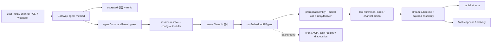

# OpenClaw 핵심 로직

이 문서는 OpenClaw에서 입력이 실제 실행과 최종 응답으로 바뀌는 경로를 추적한다. 결론부터 말하면 OpenClaw의 핵심 로직은 “부트스트랩 → 게이트웨이 수락 → 세션 해석 → 큐 직렬화 → 내장 에이전트 실행 → 도구·브라우저·노드·채널 부작용 → 스트리밍·최종 산출물 조립”의 연쇄로 구성되며, 복잡성의 대부분은 모델 호출이 아니라 세션 정합성, 권한 경계, 실패 복구, 장기 작업 유지에 있다.

## 먼저 짚고 넘어갈 실행 경로

OpenClaw의 메인 실행 경로는 `openclaw.mjs`, `src/entry.ts`, `src/cli/run-main.ts`, `src/gateway/server-methods/agent.ts`, `src/agents/agent-command.ts`, `src/agents/pi-embedded-runner/run.ts`에 집중되어 있다. 이 파일들을 이어 보면 OpenClaw는 하나의 거대한 함수가 아니라, 여러 층의 좁은 책임이 순차적으로 이어지는 구조다.

여기서 먼저 짚어 둘 점은 세 가지다.

- 게이트웨이는 작업을 직접 끝내지 않고 실행을 위임한다.
- 실행기는 모델 호출기보다 세션·도구·재시도·스트리밍 조정기에 가깝다.
- 포그라운드 한 턴만으로 제품 전체를 설명할 수 없다. cron, 훅, 백그라운드 태스크, ACP 세션까지 같은 코어 로직 주위에 붙어 있다.

## 1. 부트스트랩은 단순 진입점이 아니라 실행 환경 정리 단계다

`openclaw.mjs`는 단순 런처가 아니다. Node 버전 하한을 검사하고, 컴파일 캐시를 활성화하며, 경고 필터를 설치하고, 빌드 산출물이 없는 경우 구체적 오류 메시지를 만든다. 즉 이 파일은 “Node에서 실행 가능한가”를 먼저 보증하는 부트스트랩이다.

그다음 `src/entry.ts`는 진짜 엔트리 허브 역할을 한다. 여기서 다음이 처리된다.

- 메인 모듈 여부 확인
- 프로세스 환경 정리
- 프로파일·컨테이너 인자 보정
- 빠른 도움말·버전 출력 경로
- 필요한 경우 CLI 재실행 계획 수행
- TLS 시작 환경 보조 초기화

이 설계는 컨테이너 모드, 프로파일 모드, Windows 인자 보정, dist 산출물 유무 같은 현실적 문제를 런타임 초기에 흡수한다.

## 2. `run-main.ts`는 명령 파싱보다 더 많은 일을 한다

`src/cli/run-main.ts`는 흔한 CLI 초기화 파일보다 훨씬 두껍다. 여기서는 `.env` 로딩, 전역 프록시 디스패처, 런타임 버전 검증, 플러그인 명령 등록, 전역 예외 처리, 메모리 런타임 종료 정리까지 수행한다.

이 파일이 중요한 이유는 OpenClaw가 “CLI 명령 = 즉시 실행되는 함수”라는 단순 모델을 쓰지 않기 때문이다. 실제로는 다음 세 가지 중 하나로 라우팅된다.

- 도움말·버전처럼 빠른 경로로 끝나는 명령
- 게이트웨이를 직접 띄우거나 관리하는 운영 명령
- 게이트웨이 또는 내장 실행기를 통해 에이전트 로직으로 넘어가는 명령

특히 플러그인 CLI 등록이 명령 파싱 이전에 개입하는 구조는 OpenClaw의 명령 표면이 코어만의 것이 아니라 플러그인 생태계에 의해 확장된다는 사실을 보여 준다.

## 3. `agent` 명령은 기본적으로 게이트웨이를 거친다

OpenClaw에서 `agent(에이전트)` 명령은 곧바로 로컬 실행기로 뛰어들지 않는다. `src/commands/agent-via-gateway.ts`가 보여 주듯, 기본 경로는 게이트웨이 메서드 호출이고 실패 시 내장 실행 경로로 내려간다. 즉 “터미널에서 실행한다”와 “게이트웨이를 사용한다”가 서로 배타적이지 않다.

이 선택은 제품 철학과 맞닿아 있다. OpenClaw의 진짜 상태 중심은 게이트웨이에 있으므로, 가능하다면 CLI도 같은 제어 평면을 거치는 편이 세션·전달·관측 일관성에 유리하다. 로컬 직접 실행은 예외 경로나 복구 경로에 더 가깝다.

## 4. 게이트웨이는 요청을 처리하지 않고 먼저 수락한다

`src/gateway/server-methods/agent.ts`는 OpenClaw 요청 흐름의 전환점이다. 여기서 중요한 것은 “받은 메시지를 곧바로 처리하지 않는다”는 점이다. 이 핸들러는 대략 다음 순서로 동작한다.

1. 입력과 첨부를 정규화한다.
2. 클라이언트의 권한 범위를 확인한다.
3. 세션 키와 전달 문맥을 계산한다.
4. `runId(실행 ID)`와 멱등성 정보를 준비한다.
5. 즉시 수락 응답을 반환한다.
6. 실제 실행은 백그라운드 비동기 경로로 넘긴다.
7. 완료 후 최종 응답이나 오류를 다시 전달한다.

이 패턴은 OpenClaw가 긴 작업과 스트리밍을 정상 경로로 취급한다는 뜻이다. 짧게 말하면 게이트웨이는 “처리기”보다 “디스패처”에 가깝다.

## 5. 세션 해석은 단순 채팅 ID 매핑이 아니다

OpenClaw의 세션 모델은 핵심 로직의 중심이다. `src/gateway/server-methods/agent.ts`, `src/agents/command/session.ts`, `src/config/sessions/**`, `src/sessions/**`, `src/gateway/session-utils.ts`를 따라가면 세션이 다음을 함께 가진다는 점이 보인다.

- `sessionKey(세션 키)`, `sessionId(세션 ID)`
- `agentId(에이전트 ID)`
- 채널 대상과 스레드 문맥
- `workspace(작업 공간)`와 소유자
- 하위 에이전트 부모-자식 관계
- 모델 override, `reasoning(추론 수준)`, `elevated(상승 권한 수준)`
- 전달 정책과 응답 채널 정보
- 사용량과 종료 상태 메타데이터

이 구조 때문에 OpenClaw는 단순한 채팅 로그 저장소와 다르게 동작한다. 메시지는 세션을 만드는 재료일 뿐이고, 실제로 보존되는 것은 “실행 가능한 작업 문맥”이다.

## 6. `agentCommand(에이전트 명령)` 계층은 실행 전 최종 조정자다

`src/agents/agent-command.ts`는 OpenClaw 내부에서 가장 중요한 조정자 중 하나다. 이 계층은 게이트웨이에서 받은 요청을 실제 `embedded runner(내장 실행기)`로 넘기기 전에 다음을 정리한다.

- 런타임 설정과 비밀값 해석
- 세션 조회와 갱신
- `agentId(에이전트 ID)` 및 작업 공간 결정
- 명시적 모델·제공자 override 적용
- `auth profile(인증 프로필)` 저장소 준비
- 스킬 스냅샷 및 필터링
- 전달 정책과 응답 채널 컨텍스트 준비
- 실패 시 `fallback(대체 경로)` 후보 계산

즉 `agent-command.ts`는 “프롬프트를 모델에 보낸다”보다 “실행에 필요한 시스템 상태를 모두 정렬한다”는 표현이 더 정확하다.

## 7. 직렬화는 `CommandLane(명령 레인)`이 담당한다

OpenClaw는 같은 세션에서 여러 실행이 뒤엉키는 것을 허용하지 않는다. `src/process/command-queue.ts`는 레인별 큐를 유지하고, 재시작·드레인 상태에서 새 작업을 제한하며, 레인 세대와 활성 작업 집합까지 관리한다.

`src/agents/pi-embedded-runner/run.ts`는 이 큐를 두 단계로 사용한다.

- `session lane(세션 레인)`: 동일 세션 안의 충돌 방지
- `global lane(전역 레인)`: 전체 프로세스 수준 제어

이 구조가 필요한 이유는 명확하다. 같은 세션에서 두 실행이 동시에 도구를 호출하거나 세션 상태를 갱신하면 결과가 쉽게 꼬인다. OpenClaw는 병렬성을 포기하지 않되, 세션 정합성을 깨는 병렬성은 금지한다.

## 8. `runEmbeddedPiAgent(내장 Pi 실행기)`는 실제 실행 루프의 중심이다

`src/agents/pi-embedded-runner/run.ts`는 OpenClaw 핵심 로직의 무게중심이다. 이 함수는 세션 키 보강, 작업 공간 결정, 컨텍스트 엔진 초기화, 런타임 플러그인 로드, 모델 해석, 인증 프로필 적용, 큐 진입, 시도 루프, 실패 복구, 최종 페이로드 조립까지 모두 조정한다.

이 계층의 핵심 특징은 “한 번 시도하고 끝”이 아니라는 점이다. OpenClaw는 다음 같은 실패를 일급으로 취급한다.

- 빈 응답
- 문맥 초과
- 인증 실패
- 과금 또는 속도 제한 문제
- 유휴 타임아웃
- 과대 `tool result(도구 결과)`
- 제공자별 스트리밍 불일치
- 라이브 모델 전환 요구

즉 실행기는 성공 경로보다 실패 경로를 더 많이 알고 있다. 이것이 실제 운영형 에이전트 시스템에서 필요한 태도다.

## 9. 프롬프트는 실행 시점에 여러 조각을 합쳐 만든다

OpenClaw의 `prompt assembly(프롬프트 조립)`는 정적 문자열 결합이 아니다. `src/agents/pi-embedded-runner/system-prompt.ts`, `src/agents/system-prompt.ts`, `src/agents/skills.ts`, `extensions/memory-core/src/prompt-section.ts`를 함께 보면 최종 프롬프트는 여러 계층이 합쳐진 결과물이다.

핵심 재료는 다음과 같다.

- 기본 시스템 지침
- 스킬 스냅샷과 스킬 프롬프트
- 작업 공간 컨텍스트 파일과 런타임 노트
- 메모리 섹션과 메모리 도구 사용 가이드
- 모델별 제약과 제공자별 `prompt contribution(프롬프트 기여분)`
- 실행 중 `override(오버라이드)`

이 구조가 중요한 이유는 OpenClaw가 프롬프트를 문서가 아니라 런타임 구성 산출물로 보기 때문이다. 즉 프롬프트는 코드, 스킬, 메모리, 세션 상태가 만나는 합성 지점이다.

## 10. 컨텍스트 관리와 `compaction(압축 요약)`은 부가 기능이 아니라 생존 전략이다

OpenClaw는 긴 세션과 큰 도구 결과를 정상 전제로 두기 때문에 컨텍스트 관리가 핵심이다. `src/context-engine/**`, `src/agents/pi-hooks/context-pruning/**`, `src/agents/pi-embedded-runner/compact*.ts`, `tool-result-truncation.ts`는 모두 이 문제를 해결하기 위한 계층이다.

특히 다음 설계가 중요하다.

- 컨텍스트 엔진 초기화와 유지보수 분리
- 도구 결과가 너무 커지면 잘라 내는 사전 방어
- 세션 과포화 시 자동 또는 수동 `compaction(압축 요약)`
- 훅과 결합된 컨텍스트 pruning

일반적인 챗봇 시스템은 “메시지 몇 개”를 다루므로 이 문제가 비교적 단순하다. OpenClaw는 브라우저, 파일, 패치, 메시징, 기기 제어가 엮인 긴 세션을 다루므로, 컨텍스트 관리는 사실상 핵심 비즈니스 로직이다.

## 11. 훅 생명주기는 세션과 실행 루프에 직접 개입한다

OpenClaw의 훅은 주변 장식이 아니다. `src/hooks/internal-hooks.ts`, `src/hooks/plugin-hooks.ts`, `src/hooks/loader.ts`, `src/plugins/hook-runner-global.ts`를 보면 내부 훅과 플러그인 훅이 실행 루프와 게이트웨이 생명주기에 직접 결합한다.

핵심 포인트는 다음과 같다.

- 내부 훅은 메시지 수신·전송, 세션 패치, 명령, 게이트웨이 시작 같은 이벤트를 가로챈다.
- 플러그인 훅은 `before_model_resolve`, `before_prompt_build`, `before_compaction`, `tool_result_persist` 같은 시점에 개입할 수 있다.
- `compaction(압축 요약)` 전후도 훅 이벤트로 노출된다.
- 번들 `session-memory` 훅은 `/new`, `/reset` 이후 이전 세션 내용을 메모리 파일로 내린다.

짧게 말하면 훅은 “실행 후 통지”가 아니라 “실행 과정 개입점”에 가깝다. 그래서 훅 로더와 정책이 코어 런타임 근처에 놓여 있다.

## 12. 도구 경로는 모델 판단과 실행 권한을 의도적으로 분리한다

OpenClaw에서 모델은 도구를 고를 수 있어도, 실행 권한을 최종 결정하지는 못한다. `src/agents/tool-policy-pipeline.ts`, `src/agents/sandbox/**`, `src/node-host/exec-policy.ts`, `extensions/browser/src/browser-tool.ts`, 채널 액션 어댑터가 이 경계에 관여한다.

도구 실행은 대략 다음 구조를 가진다.

1. 모델이 도구 호출 의도를 낸다.
2. 도구 목록이 정책 파이프라인을 통과한다.
3. 샌드박스·세션·채널·노드 정책이 교차 적용된다.
4. 실제 실행기는 도구 또는 노드 명령을 수행한다.
5. 결과는 다시 실행 루프와 스트리밍 계층으로 올라온다.

이 구조가 중요한 이유는 OpenClaw가 텍스트 생성 시스템이 아니라 부작용을 발생시키는 시스템이기 때문이다. 브라우저 조작, 메시지 전송, 파일 수정, `system.run`, 모바일 장치 명령은 모두 위험도가 다르므로 동일한 정책으로 다룰 수 없다.

## 13. 스트리밍은 단순 토큰 전달이 아니라 사용자용 응답 재구성이다

`src/agents/pi-embedded-subscribe.ts`와 관련 핸들러들은 모델·에이전트 이벤트를 OpenClaw 응답 형태로 재구성한다. 여기서 처리되는 것은 단순 텍스트 누적이 아니다.

- `assistant(비서)` 텍스트 델타
- 도구 실행 시작·종료 이벤트
- `reasoning(추론 노출)` 스트림
- 블록 응답 분할
- 중복 메시지 억제
- 미디어 첨부 병합
- 자동 압축 중간 상태

즉 OpenClaw의 스트리밍 계층은 “모델 토큰을 그대로 사용자에게 보여 주는” 것이 아니라 “사용자와 채널이 읽을 수 있는 응답으로 재편집하는” 계층이다.

## 14. 최종 산출물은 문자열 하나가 아니라 전달용 구조체다

실행이 끝나면 OpenClaw는 단순 `string(문자열)`을 돌려주지 않는다. `src/agents/pi-embedded-runner/run/payloads.ts`와 `src/gateway/server-methods/agent.ts`를 보면 최종 결과는 텍스트, 미디어, 사용량, 상태, 런타임 메타데이터를 포함하는 `payload(페이로드)`다.

이 산출물은 여러 소비자를 동시에 염두에 둔다.

- 게이트웨이 응답을 기다리는 클라이언트
- 스트리밍 이벤트를 보는 웹 UI
- 실제 메시징 채널 전달기
- `agent.wait(에이전트 대기)`류의 후속 조회
- 사용량 및 세션 상태 업데이트 로직

즉 결과 조립은 출력 포맷팅 문제가 아니라, 여러 표면에서 재사용 가능한 전달 산출물 설계 문제다.

## 15. `retry(재시도)`와 `failover(장애 전환)`는 주변 기능이 아니라 핵심 논리다

OpenClaw의 가장 실무적인 특징 중 하나는 실패 복구를 코어 논리로 취급한다는 점이다. `run.ts`와 하위 `run/*` 모듈들은 속도 제한, 인증 실패, 과금 문제, 문맥 초과, 빈 응답, 불완전한 턴, 제공자 불일치를 모두 별도 사유로 분류한다.

복구 전략도 하나가 아니다.

- 같은 모델에서 짧게 재시도
- 다른 인증 프로필로 회전
- 다른 모델 `fallback(대체 모델)` 적용
- `compaction(압축 요약)` 후 재시도
- 오류 문맥을 재작성해 사용자에게 노출
- 재시도 한도 초과 시 구조화된 종료 처리

이 계층이 두꺼운 이유는 명확하다. 실제 에이전트 시스템의 장애는 모델 API 호출 그 자체보다, “이번 실패를 다음 시도에서 어떻게 해석할 것인가”에서 발생하기 때문이다.

## 16. 포그라운드 턴 밖에서도 중요한 로직이 많다

### `cron(크론)` 격리 실행 경로

`src/cron/service.ts`는 스케줄 등록, 깨우기, 재시도, 상태 조회를 담당하고, `src/cron/isolated-agent/run.ts`는 실제 격리 실행을 담당한다. 이 경로는 일반 채팅 턴과 비슷한 실행기를 쓰지만, 전달 정책과 메시지 도구 사용 규칙이 다르다. 즉 자동화는 주변 기능이 아니라, 메인 실행 루프의 변형 경로다.

### 장기 작업과 `task registry(태스크 레지스트리)`

`src/tasks/task-registry.maintenance.ts`는 백그라운드 태스크가 끝난 뒤에도 상태를 유지하고, 유실된 세션과 정리 시점을 관리한다. 이는 OpenClaw가 “한 번 답하고 끝”이 아니라, 장기 실행과 후속 알림을 운영하는 시스템이라는 증거다.

### `ACP(에이전트 통신 프로토콜)` 제어 흐름

`src/acp/server.ts`, `src/acp/control-plane/**`, `src/tasks/**`를 함께 보면 ACP 쪽은 별도 `agent runtime(에이전트 실행 환경)`을 게이트웨이 세션과 접속시키고, 백그라운드 태스크와 상태 통지까지 연결한다. 이는 OpenClaw가 외부 에이전트 툴링을 단순 부가 기능이 아니라 실행 코어의 일부로 받아들이고 있음을 보여 준다.

## 17. 관측 이벤트 흐름도 함께 봐야 한다

OpenClaw는 실행형 시스템이기 때문에 관측성도 로직 일부다. `src/logging/diagnostic.ts`와 `extensions/diagnostics-otel/src/service.ts`를 보면 다음 이벤트가 구조화되어 추적된다.

- 웹훅 수신과 처리 시간
- 메시지 큐잉과 처리 결과
- 세션 상태 전이
- 레인 큐 깊이와 대기 시간
- 사용량, 비용, 실행 시간
- `OTel(오픈텔레메트리)` 트레이스·메트릭·로그 내보내기

이 점은 실무적으로 중요하다. OpenClaw는 설명 가능한 설계뿐 아니라, 실제 문제를 재현하고 운영 상태를 읽을 수 있는 진단 흐름을 함께 구축한 시스템이다.

## 18. 테스트가 고정하는 동작도 함께 봐야 한다

OpenClaw는 문서만큼이나 테스트가 의도를 많이 드러낸다. `src/agents/pi-embedded-runner/*.test.ts`, `src/gateway/**/*.test.ts`, `src/cron/**/*.test.ts`, `src/tasks/**/*.test.ts`, `src/agents/sandbox/**/*.test.ts`, `src/hooks/*.test.ts`를 보면 어떤 동작이 “우연히 작동하는 구현”이 아니라 “깨지면 안 되는 계약”인지 읽을 수 있다.

특히 테스트가 강하게 고정하는 주제는 다음과 같다.

- 세션 키 보강과 세션 경계 유지
- `tool result(도구 결과)` 절단과 컨텍스트 과포화 방지
- `compaction(압축 요약)` 타임아웃과 재시도 조건
- 제공자별 스트림 호환성과 파라미터 전달
- 인증 프로필 회전과 `fallback(대체 경로)` 규칙
- 샌드박스, 승인, PTY 관련 프로세스 안전성
- 크론 전달 정책과 태스크 정리
- 훅 로딩과 훅 경로 안전성

## 핵심 실행 경로를 한 장으로 요약하면 다음과 같다

이 다이어그램이 보여 주는 핵심은 OpenClaw가 “한 번의 모델 호출”이 아니라 “긴 실행과 부작용을 안전하게 조율하는 상태 기계”라는 점이다.

## 정리

OpenClaw의 핵심 로직은 게이트웨이가 세션과 권한을 정리하고, `agent-command(에이전트 명령 계층)`이 실행 문맥을 조정하며, `embedded runner(내장 실행기)`가 큐·모델·프롬프트·도구·재시도·스트리밍을 책임지는 구조로 요약할 수 있다. 실제 난제는 모델 품질보다 세션 정합성, 실패 해석, 부작용 통제, 장기 실행 유지에 있다.

이 관점을 잡아 두면 OpenClaw가 왜 단순한 AI 채팅 앱보다 훨씬 큰 저장소를 가지는지도 이해된다. 이 저장소의 크기는 기능 과시보다, 실행형 에이전트 시스템이 필연적으로 요구하는 상태 관리, 권한 경계, 자동화, 진단, 외부 브리지, 배경 작업 복합도를 반영한 결과로 보는 편이 정확하다.
